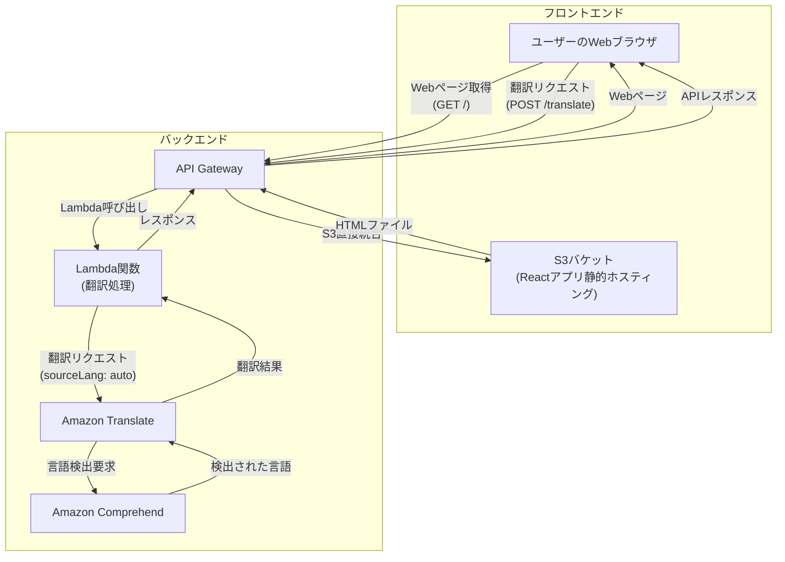

---
fonts:
  sans: Noto Sans JP
  serif: Noto Serif JP
  mono: Fira Code
theme: seriph
---

# AWS CDKワークショップ

AWS CDKでインフラ構築を体験しよう！
90分で「できる！」を実感
TypeScriptで学ぶIaC

<!--
参加者の緊張をほぐすように、明るく元気にスタートしましょう。
-->

---

# 本日のゴール

- CDKの基本を理解する
- サンプルコードでCDKの威力を体験
- 自分でWebアプリのインフラを構築
- 「できた！」を持ち帰る

<!--
参加者が今日何を得られるかを明確にして、モチベーションを高めましょう。
-->

---

# 事前準備の確認

- ✅ AWSアカウント（Admin権限）
- ✅ AWS CLIがインストール・設定済み
- ✅ TypeScript開発環境
- ✅ ノートPC持参

💡ヒント  
準備に不安がある方は、講師やサポーターにお声がけください

---

# 本日の流れ

1. CDKの概要と体験
2. サンプルコードでCDKを動かす
3. コードの中身を理解
4. 自分でWebアプリのインフラを構築
5. まとめ・質疑応答

---

# インフラとIaCの再確認

- **インフラ** = Webアプリの「土台」
- **IaC（Infrastructure as Code）** = インフラをコードで管理
- 例：家の設計図を描くように、インフラも「設計図（コード）」で作る

💡ヒント  
「手作業で設定」→「コードで自動化」の違いを意識しましょう

---

# IaCのメリット

- 何度でも同じ環境を作れる
- 変更履歴が残る
- チームで共有しやすい
- ミスが減る

---

# AWS CDKとは？

- AWSのインフラをTypeScriptなどで記述できるツール
- 「レゴブロック」のように部品を組み合わせて作る感覚
- AWS公式サポートの代表的なIaCツール


---

# CDKの特徴・メリット

- コードでAWSリソースを管理
- 再利用・自動化が簡単
- AWS公式サポート
- TypeScript/JavaScript/Pythonなどに対応

---

# 体験：サンプルコードでCDKを動かしてみよう

事前に用意した翻訳Webアプリのサンプルコードを使って、CDKの威力を体験しましょう！

1. リポジトリをクローン
2. CDKコマンドでデプロイ
3. AWS上にリソースが作られる様子を確認
4. 実際にWebアプリを動かしてみる

💡ヒント  
うまくいかない場合は講師やサポーターに声をかけてください

---

# サンプルアプリのアーキテクチャ



---

# サンプルコードの中身を見てみよう

CDKでこれだけのインフラが簡単に作れます！

```ts {monaco}
export class TranslateAppStack extends cdk.Stack {
  constructor(scope: Construct, id: string, props?: cdk.StackProps) {
    super(scope, id, props);

    // S3バケット
    const bucket = new s3.Bucket(this, 'WebsiteBucket');
    
    // Lambda関数
    const translateFunction = new lambda.Function(this, 'TranslateFunction', {
      runtime: lambda.Runtime.NODEJS_18_X,
      handler: 'index.handler',
      code: lambda.Code.fromAsset('lambda/translate'),
    });

    // API Gateway
    const api = new apigateway.RestApi(this, 'TranslateApi');
  }
}
```

<!--
実際のコードを見せながら、「これだけでこんなに多くのリソースが作れる」ことを強調しましょう。
-->

---

# ハンズオン：自分でWebアプリを作ってみよう

これから皆さんに作っていただくのは、シンプルな翻訳Webアプリです

**使用するAWSサービス：**
- S3（静的ファイル保存）
- Lambda（翻訳処理）
- API Gateway（APIエンドポイント）
- Amazon Translate（翻訳サービス）

---

# CDKプロジェクトの作成

```bash
# 新しいディレクトリを作成
mkdir my-translate-app
cd my-translate-app

# CDKプロジェクトを初期化
cdk init app --language typescript

# 必要なパッケージをインストール
npm install
```

💡ヒント  
エラーが出た場合は、Node.jsのバージョンを確認してください

---

# S3バケットを作成しよう

S3 = ファイルを保存する「倉庫」

```ts {monaco}
import * as s3 from 'aws-cdk-lib/aws-s3';

export class MyTranslateStack extends cdk.Stack {
  constructor(scope: Construct, id: string, props?: cdk.StackProps) {
    super(scope, id, props);

    // S3バケットを作成
    const websiteBucket = new s3.Bucket(this, 'WebsiteBucket', {
      bucketName: `translate-app-${this.account}-${this.region}`,
      removalPolicy: cdk.RemovalPolicy.DESTROY,
    });
  }
}
```

---

# Lambda関数を作成しよう

Lambda = サーバーレスでコードを実行

```ts {monaco}
import * as lambda from 'aws-cdk-lib/aws-lambda';

// Lambda関数を作成
const translateFunction = new lambda.Function(this, 'TranslateFunction', {
  runtime: lambda.Runtime.NODEJS_18_X,
  handler: 'index.handler',
  code: lambda.Code.fromAsset('lambda/translate'),
  environment: {
    BUCKET_NAME: websiteBucket.bucketName,
  },
});

// S3への読み書き権限を付与
websiteBucket.grantReadWrite(translateFunction);
```

---

# API Gatewayを作成しよう

API Gateway = Web APIの入り口

```ts {monaco}
import * as apigateway from 'aws-cdk-lib/aws-apigateway';

// API Gatewayを作成
const api = new apigateway.RestApi(this, 'TranslateApi', {
  restApiName: 'Translate Service',
  description: 'This service translates text.',
});

// /translate エンドポイントを追加
const translateIntegration = new apigateway.LambdaIntegration(translateFunction);
api.root.addResource('translate').addMethod('POST', translateIntegration);
```

---

# デプロイしてみよう

```bash
# CloudFormationテンプレートを生成
cdk synth

# AWSにデプロイ
cdk deploy
```

💡ヒント  
デプロイには数分かかります。焦らず待ちましょう！

<!--
デプロイ中に、参加者同士で進捗を確認し合ったり、質問タイムにするのも良いでしょう。
-->

---

# 動作確認

1. AWSコンソールでリソースを確認
2. API GatewayのエンドポイントURLを取得
3. 翻訳APIをテスト
4. Webアプリにアクセスして動作確認

---

# よくあるエラーと対処法

- **権限エラー**: IAMロールやポリシーを確認
- **デプロイ失敗**: AWS CLIの設定やリージョンを確認
- **タイプエラー**: コードのスペルミスを確認

💡ヒント  
エラーメッセージをよく読んで、落ち着いて対処しましょう

---

# 片付け（重要！）

作成したリソースを削除して、課金を防ぎましょう

```bash
# リソースを削除
cdk destroy
```

💡ヒント  
本番環境では絶対に間違えて削除しないよう注意！

---

# まとめ

**今日学んだこと：**
- CDKでインフラをコードで管理する方法
- TypeScriptでAWSリソースを定義する書き方
- デプロイから削除までの一連の流れ

**CDKの魅力：**
- 再利用可能
- バージョン管理できる
- チームで共有しやすい

---

# さらに学ぶために

- **AWS CDK公式ドキュメント**: https://docs.aws.amazon.com/cdk/
- **CDK Examples**: https://github.com/aws-samples/aws-cdk-examples
- **AWS CDK Workshop**: https://cdkworkshop.com/

---

# 質疑応答

ご質問をお聞かせください！

- CDKに関する疑問
- 今日のハンズオンについて
- 実際の現場での活用方法

<!--
最後は「お疲れさまでした！」と笑顔で締めくくりましょう。
参加者の達成感を称えることを忘れずに。
-->

---

# ありがとうございました！

お疲れさまでした！
皆さんの今後のAWS CDK活用を応援しています 🎉

**アンケートのご協力をお願いします** 