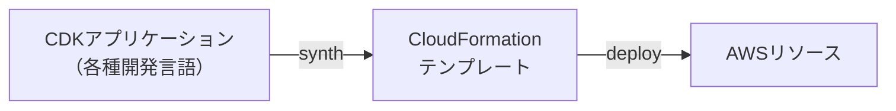
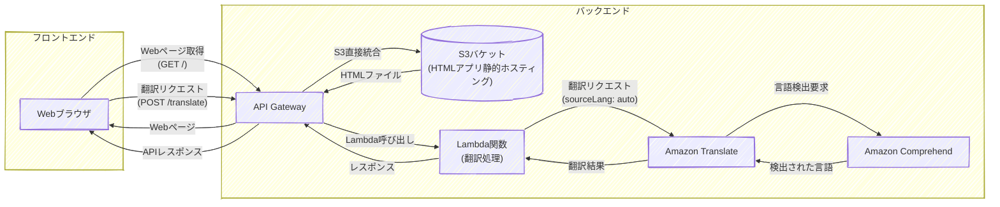
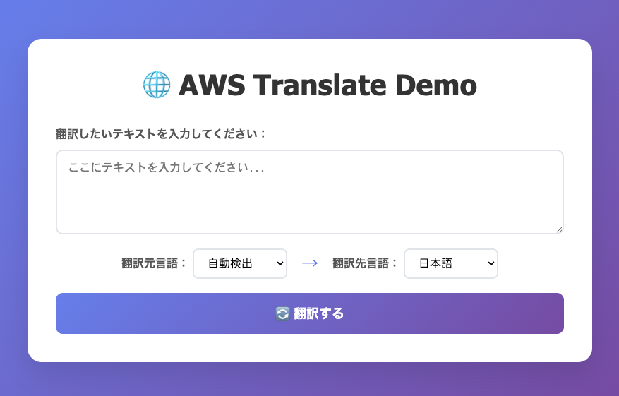
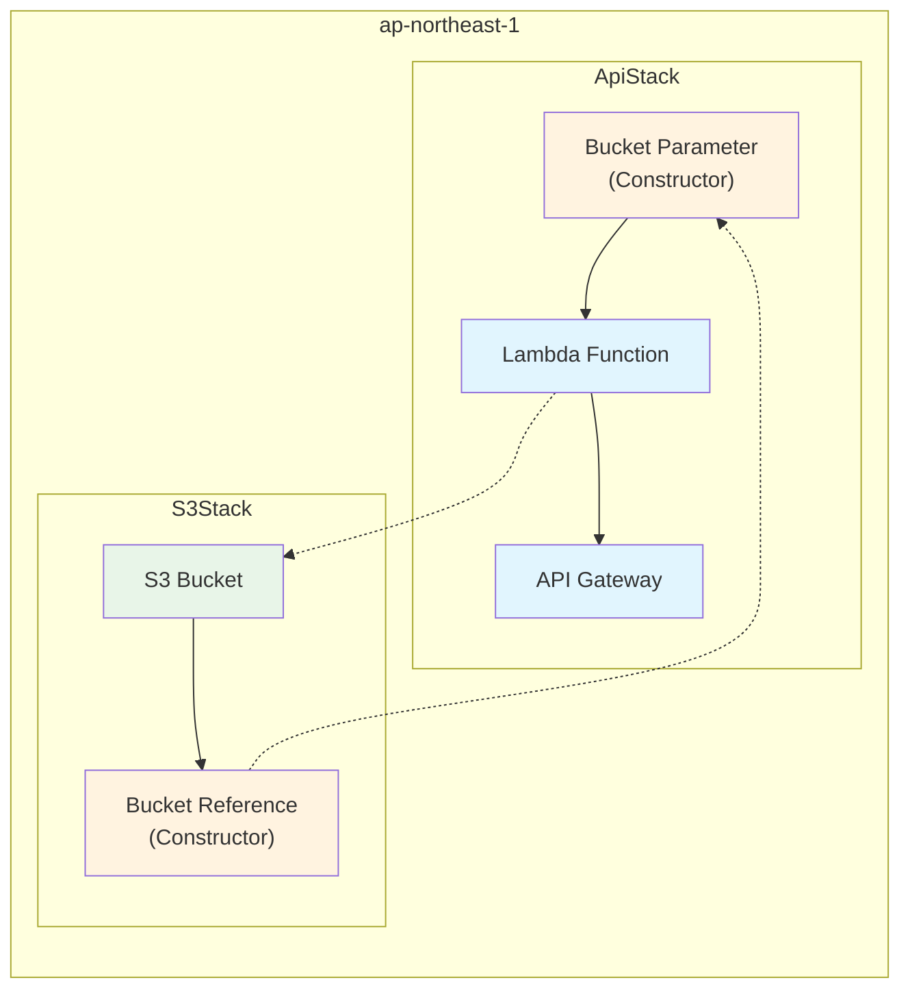
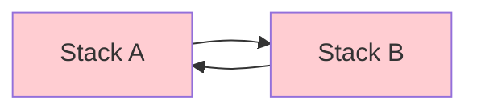
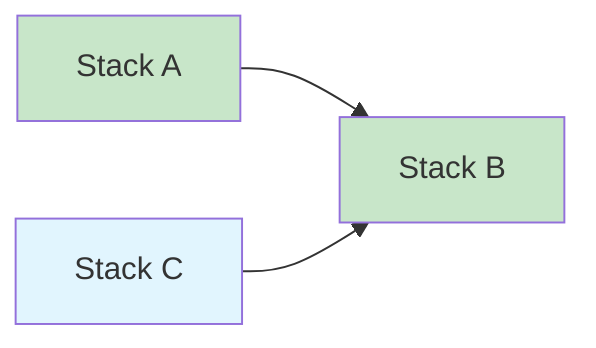
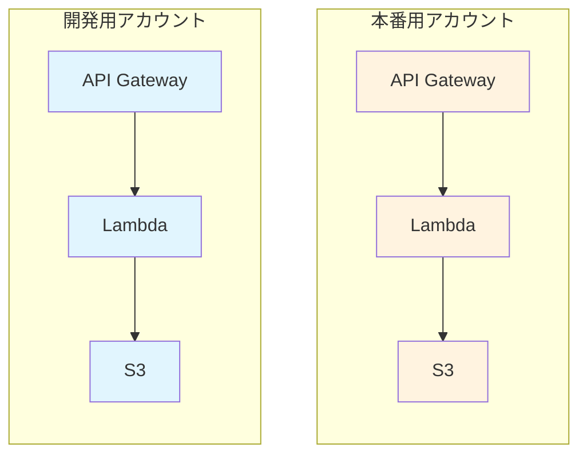
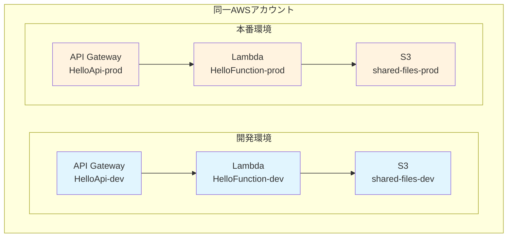

---
fonts:
  sans: Noto Sans JP
  serif: Noto Serif JP
  mono: Fira Code
theme: neversink
layout: cover
lineNumbers: true
---

# AWS CDK初心者ワークショップ

::note::

AWS CDKでインフラ構築を体験しよう！
90分で「できる！」を実感
TypeScriptで学ぶIaC

---
layout: top-title-two-cols
color: amber
align: l-lt-lt
---

::title::

# 自己紹介

::left::

- 新澤　忠士 / @tniizawa

- クラスメソッド株式会社

  製造ビジネステクノロジー部
  
  コネクティッドカーチーム

- JAWS-UG CDK支部 運営

- 好きなAWSサービス
  - CDK, IoT FleetWise, IoT Core

::right::

<div class="flex justify-center">
  <figure>
    
  </figure>
</div>

---
layout: top-title
color: amber
---

::title::

# 本日のゴール

::content::

- CDKの基本を理解する
- サンプルコードでCDKを体験
- 自分でWebアプリのインフラを構築

---
layout: top-title
color: amber
---

::title::

# 事前準備の確認

::content::

- ✅ AWSアカウント（Admin権限）
- ✅ ノートPC持参

---
layout: top-title-two-cols
color: amber
---

::title::

# 本日の流れ

::left::

<!-- Visual Studio Code Serverの構築に時間がかかるので最初にやってもらいます -->

<br/>
<br/>

1. Visual Studio Code Server環境の構築
2. CDKの概要
3. サンプルコードでCDKを動かす
4. コードの中身を理解
5. 自分でWebアプリのインフラを構築
6. 発展課題
7. まとめ・質疑応答

::right::

**本スライドのURL**:

https://bit.ly/4nz3B7d
<br/>
<br/>
<div class="flex flex-col items-center">
  <QRCode
      :width="720"
      :height="720"
      value="http://bit.ly/4nz3B7d"
      image="./images/CDK_logo.png"
  />
</div>

<!-- 
本日ワークショップの作業を行うVSCode Serverを構築してもらいます。<br/>
このデプロイに時間がかかるので、これを待っている間にCDKについての簡単な説明をさせていただこうと思います。
 -->
---
layout: top-title
color: amber
---

::title::

# Visual Studio Code Serverを構築しよう

::content::

準備いただいたAWSアカウントにVisual Studio Code Serverを構築します。

**構築手順：**

1. 「TypeScript の基礎から始める AWS CDK 開発入門」にアクセス
    - https://catalog.workshops.aws/typescript-and-cdk-for-beginner/ja-JP

2. 左メニューから「開発環境のセットアップ」→「ご自身で実施するワークショップ」→「Visual Studio Code Server のセットアップ」にアクセス

2. ”Asia Pacific (Tokyo) ap-northeast-1"の「Launch Stack」ボタンをクリック

3. 以降、ページに記載された手順に従って、Visual Studio Code IDEを表示するところまで進めてください。

※ デプロイには約8分程度かかります。


---
layout: top-title
color: amber
---

::title::

# AWS CDKとは？

::content::

- AWS公式サポートの代表的なOSS IaCツール
- AWSのインフラをTypeScriptなどの開発言語で記述できる
  - TypeScript / JavaScript / Python / Java / C# / Golangに対応
  - CloudFormationテンプレートの記法を覚えることなく、使い慣れた言語でインフラを定義
- CDKコードからCloudFormationテンプレートを生成し、デプロイ
  - デプロイ失敗時のロールバックなどCloudFormationの機能を活用できる



<!-- 
VSCode Serverのデプロイを待っている間にCDKに関する説明をします
 -->

---
layout: top-title-two-cols
color: amber
align: l-lt-lt
---

::title::

# CDKの多言語対応例

::left::

## TypeScript

```ts
export class S3Stack extends cdk.Stack {
  constructor(scope: Construct, id: string,
   props?: cdk.StackProps) {
    super(scope, id, props);

    const bucket = new s3.Bucket(this, 'MyBucket', {
      bucketName: 'my-example-bucket-12345',
      versioned: true,
      publicReadAccess: false,
      removalPolicy: cdk.RemovalPolicy.DESTROY,
      autoDeleteObjects: true,
    });

    new cdk.CfnOutput(this, 'BucketName', {
      value: bucket.bucketName
    });
  }
}
```

::right::

## Python

```python
class S3Stack(Stack):
    def __init__(self, scope: Construct, 
      construct_id: str, **kwargs) -> None:
        super().__init__(scope, construct_id, **kwargs)

        bucket = s3.Bucket(self, "MyBucket",
            bucket_name="my-example-bucket-12345",
            versioned=True,
            public_read_access=False,
            removal_policy=RemovalPolicy.DESTROY,
            auto_delete_objects=True
        )

        CfnOutput(self, "BucketName",
            value=bucket.bucket_name
        )
```

---
layout: top-title-two-cols
color: amber
---

::title::

# CDKコードからのCloudFormationテンプレート生成の例

::left::

CDKコード

```ts {monaco} { editorOptions: { lineNumbers: 'on', readOnly: true } }
const bucket = new s3.Bucket(this, 'MyBucket', {
  bucketName: 'my-example-bucket-12345',
  versioned: true,
  publicReadAccess: false,
  removalPolicy: cdk.RemovalPolicy.DESTROY,
  autoDeleteObjects: true,
});
```

::right::

CloudFormationテンプレート

```yaml {monaco} { height: '400px', editorOptions: { lineNumbers: 'on', readOnly: true } }
Resources:
  MyBucket:
    Type: AWS::S3::Bucket
    Properties:
      BucketName: my-example-bucket-12345
      VersioningConfiguration:
        Status: Enabled
      PublicAccessBlockConfiguration:
        BlockPublicAcls: true
        BlockPublicPolicy: true
        IgnorePublicAcls: true
        RestrictPublicBuckets: true
    DeletionPolicy: Delete

  # autoDeleteObjects機能を実現するためのカスタムリソース
  BucketAutoDeleteObjectsCustomResource:
    Type: AWS::CloudFormation::CustomResource
    Properties:
      ServiceToken: !GetAtt BucketAutoDeleteObjectsFunction.Arn
      BucketName: !Ref MyBucket

  # Lambda関数（バケット内オブジェクトの自動削除用）
  BucketAutoDeleteObjectsFunction:
    Type: AWS::Lambda::Function
    Properties:
      Runtime: python3.9
      Handler: index.handler
      Role: !GetAtt BucketAutoDeleteObjectsRole.Arn
      Code:
        ZipFile: |
          import boto3
          import cfnresponse
          import json
          
          def handler(event, context):
              s3 = boto3.client('s3')
              bucket_name = event['ResourceProperties']['BucketName']
              
              try:
                  if event['RequestType'] == 'Delete':
                      # バケット内の全オブジェクトを削除
                      paginator = s3.get_paginator('list_object_versions')
                      for page in paginator.paginate(Bucket=bucket_name):
                          delete_keys = []
                          if 'Versions' in page:
                              delete_keys.extend([{'Key': obj['Key'], 'VersionId': obj['VersionId']} 
                                                for obj in page['Versions']])
                          if 'DeleteMarkers' in page:
                              delete_keys.extend([{'Key': obj['Key'], 'VersionId': obj['VersionId']} 
                                                for obj in page['DeleteMarkers']])
                          
                          if delete_keys:
                              s3.delete_objects(Bucket=bucket_name, Delete={'Objects': delete_keys})
                  
                  cfnresponse.send(event, context, cfnresponse.SUCCESS, {})
              except Exception as e:
                  print(f"Error: {str(e)}")
                  cfnresponse.send(event, context, cfnresponse.FAILED, {})

  # Lambda実行ロール
  BucketAutoDeleteObjectsRole:
    Type: AWS::IAM::Role
    Properties:
      AssumeRolePolicyDocument:
        Version: '2012-10-17'
        Statement:
          - Effect: Allow
            Principal:
              Service: lambda.amazonaws.com
            Action: sts:AssumeRole
      ManagedPolicyArns:
        - arn:aws:iam::aws:policy/service-role/AWSLambdaBasicExecutionRole
      Policies:
        - PolicyName: S3DeleteObjectsPolicy
          PolicyDocument:
            Version: '2012-10-17'
            Statement:
              - Effect: Allow
                Action:
                  - s3:ListBucket
                  - s3:ListBucketVersions
                  - s3:DeleteObject
                  - s3:DeleteObjectVersion
                Resource:
                  - !Sub "${MyBucket}/*"
                  - !Ref MyBucket
```


---
layout: top-title
color: amber
---

::title::

# 体験：サンプルコードでCDKを動かしてみよう

::content::

まずは、事前に用意した翻訳Webアプリのサンプルコードを使って、CDKを体験してみましょう！

**手順：**
1. サンプルリポジトリをクローン
2. 依存関係をインストール
3. CDKコマンドでデプロイ
4. AWS上にリソースが作られる様子を確認
5. 実際にWebアプリを動かしてみる

**所要時間：** 約10-15分

---
layout: top-title
color: amber
---

::title::

# サンプルコードのアーキテクチャ

::content::

<br/>
<br/>



<div class="flex justify-center">
  <figure>
    
    <figcaption style="font-size: 10pt; text-align: center;">フロントエンド</figcaption>
  </figure>
</div>

---
layout: top-title
color: amber
---

::title::

# 実行手順 １（初回のみ）

::content::

1. リポジトリクローン

```bash 
git clone https://github.com/niizawat/cdk-workshop-example.git
cd cdk-workshop-example
```

<br/>

2. 依存関係インストール

```bash
npm install
```
<br/>

3. CDK Bootstrap

  CDKアプリケーションをデプロイする際に必要なリソースを作成
```bash
npx cdk bootstrap
```

---
layout: top-title
color: amber
---

::title::

# 実行手順 ２

::content::

4. CDK動作確認 (CDKコードをCloudFormationテンプレートに変換）

```bash
$ npx cdk synth
# 生成されたCloudFormationテンプレートが表示されればOK
```

<br/>

5. デプロイ内容の差分の確認（Optional）

```bash
$ npx cdk diff
# 生成されたCloudFormationテンプレートと現在のスタックの差分を表示
```

<br/>

5. AWSへデプロイ

```bash

$ npx cdk deploy
✨  Synthesis time: 6.69s
........
Do you wish to deploy these changes (y/n)?  <-- yを入力
```

---
layout: top-title
color: amber
---

::title::

# デプロイ後 の出力例

::content::

```bash {lines:false}
AppStack: deploying... [1/1]
AppStack: creating CloudFormation changeset...

 ✅  AppStack

✨  Deployment time: 94.21s

Outputs:
AppStack.ApiGatewayURL = https://xxxxxxxxxx.execute-api.ap-northeast-1.amazonaws.com/prod/
AppStack.BucketName = translate-website-123456789012-ap-northeast-1
AppStack.TranslateApiEndpointBF4D5864 = https://xxxxxxxxxx.execute-api.ap-northeast-1.amazonaws.com/prod/
AppStack.WebsiteURL = https://xxxxxxxxxx.execute-api.ap-northeast-1.amazonaws.com/prod/
Stack ARN:
arn:aws:cloudformation:ap-northeast-1:123456789012:stack/AppStack/d9b61de0-5485-11f0-a14f-06c66a81218f

✨  Total time: 97.31s
```

---
layout: top-title-two-cols
color: amber
align: l-lt-lt
---

::title::
# デプロイ後の動作確認

::left::

1. **Webアプリにアクセス**
   - ブラウザで `Website URL`にアクセス
   - アプリの画面が表示されることを確認

2. **翻訳APIのテスト**
   - ブラウザ上で翻訳機能を試す

3. **マネージドコンソールで確認**
   - 以下がデプロイされていることを確認
     - CloudFormationスタック
     - API Gateway
     - Lambda関数
     - S3バケット

::right::


<!-- 
Website URLは、前のスライドの出力例に表示されているURL
 -->

---
layout: top-title
color: amber
---

::title::

# CDKアプリケーションの基本的なディレクトリ構造(TypeScriptの場合)

::content::

```sh {lines:false}
├── bin/
│   └── cdk.ts          # CDKアプリのエントリーポイント
├── cdk.out/            # synthコマンドで生成されるファイル(CloudFormationテンプレート, Lambda関数コードなどのアセット)
├── lib/                # CDKコンストラクト定義ファイル格納ディレクトリ
│   └── app-stack.ts    # スタック定義（メインのインフラコード）
├── test/               # テストファイル格納ディレクトリ
├── cdk.json           # CDKプロジェクトの設定ファイル
├── jest.config.js      # テスト設定ファイル
└── tsconfig.json      # TypeScript設定ファイル
```

---
layout: top-title
color: amber
---

::title::

# CDKアプリのエントリーポイント

::content::

**bin/cdk.ts** : CDKアプリケーションのエントリーポイント(ファイル名は任意)

```ts
#!/usr/bin/env node
import * as cdk from 'aws-cdk-lib';
import { AppStack } from '../lib/app-stack';

const app = new cdk.App();
new AppStack(app, 'AppStack', {
  /* 環境設定のオプション */
  // env: { account: process.env.CDK_DEFAULT_ACCOUNT, region: process.env.CDK_DEFAULT_REGION },
  // env: { account: '123456789012', region: 'us-east-1' },
});
```

**各行の解説：**
- `import * as cdk` - AWS CDKのコアライブラリを読み込み
- `import { AppStack }` - 自作のスタック定義を読み込み
- `new cdk.App()` - CDKアプリケーションのインスタンスを作成
- `new AppStack(app, '<論理ID>')` - スタックインスタンスをアプリに追加

---
layout: top-title
color: amber
---

::title::

# CDKスタックの定義

::content::

`lib/app-stack.ts`

```ts {monaco} { height:'400px', editorOptions: { lineNumbers: 'on', minimap: 'enable' } }
import * as cdk from 'aws-cdk-lib';
import {
  aws_s3 as s3,
  aws_lambda as lambda,
  aws_apigateway as apigateway,
  aws_iam as iam,
  aws_s3_deployment as s3deploy,
} from 'aws-cdk-lib';
import { Construct } from 'constructs';

export class AppStack extends cdk.Stack {
  constructor(scope: Construct, id: string, props?: cdk.StackProps) {
    super(scope, id, props);

    // S3バケット（静的ファイル保存用）
    const websiteBucket = new s3.Bucket(this, 'TranslateWebsiteBucket', {
      bucketName: `translate-website-${this.account}-${this.region}`,
      publicReadAccess: false, // API Gateway経由でアクセスするためpublicアクセスは無効
      blockPublicAccess: s3.BlockPublicAccess.BLOCK_ALL,
      removalPolicy: cdk.RemovalPolicy.DESTROY, // バケット削除時にオブジェクトも削除
      autoDeleteObjects: true, // バケット削除時にオブジェクトも削除
    });

    // フロントエンドファイルのデプロイ
    new s3deploy.BucketDeployment(this, 'DeployWebsite', {
      sources: [s3deploy.Source.asset('./frontend')],
      destinationBucket: websiteBucket,
    });
    
    
    // Lambda関数（翻訳処理用）
    const translateFunction = new lambda.Function(this, 'TranslateFunction', {
      runtime: lambda.Runtime.NODEJS_22_X,
      handler: 'index.handler',
      code: lambda.Code.fromAsset('lambda/translate'),
      timeout: cdk.Duration.seconds(30),
    });

    // Lambda関数にTranslateとComprehendの権限を付与
    translateFunction.addToRolePolicy(new iam.PolicyStatement({
      effect: iam.Effect.ALLOW,
      actions: [
        'translate:TranslateText',
        'comprehend:DetectDominantLanguage'
      ],
      resources: ['*']
    }));


    // API Gateway（REST API）
    const api = new apigateway.RestApi(this, 'TranslateApi', {
      restApiName: 'Translate Service',
      description: 'AWS Translateを使用した翻訳API',
      // バイナリメディアタイプを設定（画像、CSS、JSファイルなど）
      binaryMediaTypes: [
        'image/*',
        'text/css',
        'application/javascript',
        'application/json',
        'text/html',
        'text/plain',
        'font/*'
      ]
    });

    // 翻訳用Lambda統合
    const translateIntegration = new apigateway.LambdaIntegration(translateFunction);

    // /translateエンドポイントの作成
    const translateResource = api.root.addResource('translate');
    translateResource.addMethod('POST', translateIntegration);

    // API GatewayがS3にアクセスするためのIAMロール
    const apiGatewayS3AccessRole = new iam.Role(this, 'ApiGatewayS3AccessRole', {
      assumedBy: new iam.ServicePrincipal('apigateway.amazonaws.com'),
    });

    // S3バケットの読み取りをAPI Gatewayに許可
    websiteBucket.grantRead(apiGatewayS3AccessRole);

    // ルートパス（/）用のS3統合 - S3バケットのindex.htmlを返す
    const rootIntegration = new apigateway.AwsIntegration({
      service: 's3',
      integrationHttpMethod: 'GET',
      path: `${websiteBucket.bucketName}/index.html`,
      options: {
        credentialsRole: apiGatewayS3AccessRole,
        passthroughBehavior: apigateway.PassthroughBehavior.WHEN_NO_TEMPLATES,
        integrationResponses: [
          {
            statusCode: '200',
            responseParameters: {
              'method.response.header.Content-Type': 'integration.response.header.Content-Type',
              'method.response.header.Content-Length': 'integration.response.header.Content-Length',
              'method.response.header.Timestamp': 'integration.response.header.Date'
            }
          },
          {
            statusCode: '400',
            selectionPattern: '4\\d{2}'
          },
          {
            statusCode: '500',
            selectionPattern: '5\\d{2}'
          }
        ]
      }
    });

    api.root.addMethod('GET', rootIntegration, {
      methodResponses: [
        {
          statusCode: '200',
          responseParameters: {
            'method.response.header.Content-Type': true,
            'method.response.header.Content-Length': true,
            'method.response.header.Timestamp': true
          }
        },
        {
          statusCode: '400'
        },
        {
          statusCode: '500'
        }
      ]
    });

    // 静的ファイル配信用のプロキシリソース（S3直接統合）
    const proxyIntegration = new apigateway.AwsIntegration({
      service: 's3',
      integrationHttpMethod: 'GET',
      path: `${websiteBucket.bucketName}/{proxy}`,
      options: {
        credentialsRole: apiGatewayS3AccessRole,
        passthroughBehavior: apigateway.PassthroughBehavior.WHEN_NO_TEMPLATES,
        requestParameters: {
          'integration.request.path.proxy': 'method.request.path.proxy'
        },
        integrationResponses: [
          {
            statusCode: '200',
            responseParameters: {
              'method.response.header.Content-Type': 'integration.response.header.Content-Type',
              'method.response.header.Content-Length': 'integration.response.header.Content-Length',
              'method.response.header.Timestamp': 'integration.response.header.Date'
            }
          },
          {
            statusCode: '400',
            selectionPattern: '4\\d{2}'
          },
          {
            statusCode: '500',
            selectionPattern: '5\\d{2}'
          }
        ]
      }
    });

    const proxyResource = api.root.addResource('{proxy+}');
    proxyResource.addMethod('GET', proxyIntegration, {
      requestParameters: {
        'method.request.path.proxy': true
      },
      methodResponses: [
        {
          statusCode: '200',
          responseParameters: {
            'method.response.header.Content-Type': true,
            'method.response.header.Content-Length': true,
            'method.response.header.Timestamp': true
          }
        },
        {
          statusCode: '400'
        },
        {
          statusCode: '500'
        }
      ]
    });

    // 出力値の設定
    new cdk.CfnOutput(this, 'WebsiteURL', {
      value: api.url,
      description: 'Website URL (via API Gateway)'
    });

    new cdk.CfnOutput(this, 'ApiGatewayURL', {
      value: api.url,
      description: 'API Gateway URL'
    });

    new cdk.CfnOutput(this, 'BucketName', {
      value: websiteBucket.bucketName,
      description: 'S3 Bucket Name'
    });

  }
}
```

<!-- 
コンストラクトについて説明する
 -->
---
layout: top-title
color: amber
---

::title::

# ハンズオン：シンプルなAPIを作ってみよう

::content::

まずは基本から！Hello WorldのAPIを作成しましょう

**使用するAWSサービス：**

- API Gateway（APIエンドポイント）
- Lambda（Hello World処理）

**作成するAPI：**
- `GET /hello` → `Hello, World!`を返す

---
layout: top-title
color: amber
---

::title::

# CDKプロジェクトの作成

::content::

新しいディレクトリを作成

```bash
cd ~/environment
mkdir my-hello-api
cd my-hello-api
```

CDKプロジェクトを初期化

```bash
npx cdk init --language typescript
```

---
layout: top-title
color: amber
---

::title::

# Lambda関数を作成しよう　１

::content::

まず、Lambda関数のコードファイルを作成します：

```bash
# Lambdaコード用のディレクトリを作成
mkdir -p lambda/hello

# Lambda関数のファイルを作成
touch lambda/hello/index.js
```

`lambda/hello/index.js` をエディタで開き、以下のコードを入力してください：

```js {monaco} { editorOptions: { lineNumbers: 'on' } }
exports.handler = async (event) => {
  return {
    statusCode: 200,
    headers: {
      'Content-Type': 'application/json',
    },
    body: JSON.stringify({
      message: 'Hello, World!',
      timestamp: new Date().toISOString()
    })
  };
};
```

---
layout: top-title
color: amber
---

::title::

# Lambda関数を作成しよう　２

::content::

次に、`lib/my-hello-api-stack.ts`を以下のように変更してLambda関数を定義します：

```ts {monaco} { editorOptions: { lineNumbers: 'on' } }
import * as cdk from 'aws-cdk-lib';
import * as lambda from 'aws-cdk-lib/aws-lambda';
import { Construct } from 'constructs';

export class MyHelloApiStack extends cdk.Stack {
  constructor(scope: Construct, id: string, props?: cdk.StackProps) {
    super(scope, id, props);

    // Lambda関数（Hello World処理用）
    const helloFunction = new lambda.Function(this, 'HelloFunction', {
      runtime: lambda.Runtime.NODEJS_22_X,
      handler: 'index.handler',
      code: lambda.Code.fromAsset('lambda/hello'),
    });
  }
}
```

---
layout: top-title
color: amber
---

::title::

# デプロイしてみよう

::content::

合成(synth)して、CloudFormationテンプレートの生成でエラーが出ないことを確認します

```bash
$ npx cdk synth
```

デプロイします

```bash {lines:false}
# デプロイ
$ npx cdk deploy

✨  Synthesis time: 6.86s
.....
Do you wish to deploy these changes (y/n)? y <-- yを入力
MyHelloApiStack: deploying... [1/1]
MyHelloApiStack: creating CloudFormation changeset...

 ✅  MyHelloApiStack
✨  Deployment time: 94.21s
Stack ARN:
arn:aws:cloudformation:ap-northeast-1:1234567898012:stack/MyHelloApiStack/9086c390-5aca-11f0-9c58-06e431bf345f
✨  Total time: 58.78s```
```
マネジメントコンソールでLambdaコンソールにアクセスし、`HelloFunction`が作成されていることを確認してください。

---
layout: top-title
color: amber
---

::title::

# API Gatewayを作成しよう

::content::

右の内容に修正してください

```ts {monaco-diff} { height: '400px', editorOptions: { lineNumbers: 'on', readOnly: true } }
import * as cdk from 'aws-cdk-lib';
import * as lambda from 'aws-cdk-lib/aws-lambda';
import { Construct } from 'constructs';

export class MyHelloApiStack extends cdk.Stack {
  constructor(scope: Construct, id: string, props?: cdk.StackProps) {
    super(scope, id, props);

    // Lambda関数（Hello World処理用）
    const helloFunction = new lambda.Function(this, 'HelloFunction', {
      runtime: lambda.Runtime.NODEJS_22_X,
      handler: 'index.handler',
      code: lambda.Code.fromAsset('lambda/hello'),
    });
  }
}
~~~
import * as cdk from 'aws-cdk-lib';
import * as lambda from 'aws-cdk-lib/aws-lambda';
import * as apigateway from 'aws-cdk-lib/aws-apigateway';
import { Construct } from 'constructs';

export class MyHelloApiStack extends cdk.Stack {
  constructor(scope: Construct, id: string, props?: cdk.StackProps) {
    super(scope, id, props);

    // Lambda関数（Hello World処理用）
    const helloFunction = new lambda.Function(this, 'HelloFunction', {
      runtime: lambda.Runtime.NODEJS_22_X,
      handler: 'index.handler',
      code: lambda.Code.fromAsset('lambda/hello'),
    });
    // API Gateway（REST API）
    const api = new apigateway.RestApi(this, 'HelloApi', {
      restApiName: 'Hello World API',
      description: 'Hello World API',
    });

    // Lambda統合
    const helloIntegration = new apigateway.LambdaIntegration(helloFunction);

    // /helloエンドポイントの作成
    const helloResource = api.root.addResource('hello');
    helloResource.addMethod('GET', helloIntegration);

    // 出力値の設定
    new cdk.CfnOutput(this, 'ApiUrl', {
      value: api.url,
      description: 'API Gateway URL'
    });
  }
}
```

---
layout: top-title
color: amber
---

::title::

# 追加されるリソースを確認してみよう

::content::

`cdk diff`コマンドを使って、追加されるリソースを確認します
- `[+]`：追加されるリソース
- `[-]`：削除されるリソース

```bash {lines:false}
$ npx cdk diff
.......
Resources
[+] AWS::ApiGateway::RestApi HelloApi HelloApi3F989F66
[+] AWS::ApiGateway::Deployment HelloApi/Deployment HelloApiDeployment9558280802b9217f293d8c58cf6068659f4fb193
[+] AWS::ApiGateway::Stage HelloApi/DeploymentStage.prod HelloApiDeploymentStageprodE85054A7
[+] AWS::ApiGateway::Resource HelloApi/Default/hello HelloApihello0292B1E3
[+] AWS::Lambda::Permission HelloApi/Default/hello/GET/ApiPermission.MyHelloApiStackHelloApi335DAE28.GET..hello HelloApihelloGETApiPermissionMyHelloApiStackHelloApi335DAE28GEThelloDB885900
[+] AWS::Lambda::Permission HelloApi/Default/hello/GET/ApiPermission.Test.MyHelloApiStackHelloApi335DAE28.GET..hello HelloApihelloGETApiPermissionTestMyHelloApiStackHelloApi335DAE28GEThello836F3F4A
[+] AWS::ApiGateway::Method HelloApi/Default/hello/GET HelloApihelloGET34B3ECE0

Outputs
[+] Output HelloApi/Endpoint HelloApiEndpoint91438085: {"Value":{"Fn::Join":["",["https://",{"Ref":"HelloApi3F989F66"},".execute-api.",{"Ref":"AWS::Region"},".",{"Ref":"AWS::URLSuffix"},"/",{"Ref":"HelloApiDeploymentStageprodE85054A7"},"/"]]}}
[+] Output ApiUrl ApiUrl: {"Description":"API Gateway URL","Value":{"Fn::Join":["",["https://",{"Ref":"HelloApi3F989F66"},".execute-api.",{"Ref":"AWS::Region"},".",{"Ref":"AWS::URLSuffix"},"/",{"Ref":"HelloApiDeploymentStageprodE85054A7"},"/"]]}}
.......
```


---
layout: top-title
color: amber
---

::title::

# 動作確認してみよう

::content::

```bash {lines:false}
# デプロイ
$ npx cdk deploy

# API Gateway URLにアクセス
curl https://xxxxxxxxxx.execute-api.ap-northeast-1.amazonaws.com/prod/hello

# レスポンス例
{"message":"Hello, World!","timestamp":"2025-07-07T00:47:45.296Z"}
```

---
layout: top-title
color: amber
---

::title::

# 🎉 おめでとうございます！

::content::

CDKを使ってシンプルなAPIを作成できました！

**できたこと：**
- Lambda関数の作成
- API Gatewayの作成
- CDKでのデプロイ
- 差分の確認

---
layout: top-title
color: amber
---

::title::

# 🚀 発展課題にチャレンジ！

::content::

以下の課題にチャレンジしてみましょう：

- スタックを追加してみる
  - 最初のスタックとは違うリージョンに作成
- スタック間でリソースを参照する
- 本番環境と開発環境を分離する


---
layout: top-title
color: amber
---
::title::

# 🔧 新しいスタックを作成してみよう

::content::

**手順：**

1. 新しいスタッククラスを作成
2. `app.ts`でスタックをインスタンス化
3. デプロイして確認

---
layout: top-title
color: amber
---

::title::

# ステップ1: 新しいスタッククラスを作成

::content::

`lib/database-stack.ts`を作成：

```ts {monaco} { editorOptions: { lineNumbers: 'on' }, height: '400px' }
import * as cdk from 'aws-cdk-lib';
import * as dynamodb from 'aws-cdk-lib/aws-dynamodb';
import { Construct } from 'constructs';

export class DatabaseStack extends cdk.Stack {
  constructor(scope: Construct, id: string, props?: cdk.StackProps) {
    super(scope, id, props);

    // DynamoDBテーブルを作成
    const table = new dynamodb.Table(this, 'UserTable', {
      tableName: 'users',
      partitionKey: { name: 'id', type: dynamodb.AttributeType.STRING },
      billingMode: dynamodb.BillingMode.PAY_PER_REQUEST,
      removalPolicy: cdk.RemovalPolicy.DESTROY,
    });

    // 出力値の設定
    new cdk.CfnOutput(this, 'TableName', {
      value: table.tableName,
      description: 'DynamoDB Table Name'
    });
  }
}
```

---
layout: top-title
color: amber
---

::title::

# ステップ2: スタックをインスタンス化

::content::

`bin/my-hello-api.ts`を編集して、新しいスタックを追加：

```ts {monaco-diff} { height: '400px', editorOptions: { lineNumbers: 'on', readOnly: true } }
import * as cdk from 'aws-cdk-lib';
import { MyHelloApiStack } from '../lib/my-hello-api-stack';

const app = new cdk.App();
new MyHelloApiStack(app, 'MyHelloApiStack', {
  env: { account: process.env.CDK_DEFAULT_ACCOUNT, region: process.env.CDK_DEFAULT_REGION },
});
~~~
import * as cdk from 'aws-cdk-lib';
import { MyHelloApiStack } from '../lib/my-hello-api-stack';
import { DatabaseStack } from '../lib/database-stack';

const app = new cdk.App();
new MyHelloApiStack(app, 'MyHelloApiStack', {
  env: { account: process.env.CDK_DEFAULT_ACCOUNT, region: process.env.CDK_DEFAULT_REGION },
});

new DatabaseStack(app, 'DatabaseStack', {
  env: { account: process.env.CDK_DEFAULT_ACCOUNT, region: 'us-east-1' },
});
```

---
layout: top-title
color: amber
---

::title::

# ステップ3: デプロイして確認

::content::

**スタックのリストを出力して確認：**

```bash
# すべてのスタックを表示
$ npx cdk list
MyHelloApiStack
DatabaseStack
```

**個別にデプロイ：**

```bash
# 特定のスタックのみデプロイ
$ npx cdk deploy DatabaseStack

# 全てのスタックをデプロイ
$ npx cdk deploy --all
```

**マネジメントコンソールで確認：**

- 東京リージョン（ap-northeast-1）: API Gateway、Lambda
- バージニア北部リージョン（us-east-1）: DynamoDB

---
layout: top-title
color: amber
---

::title::

# 🔗 スタック間でリソースを参照してみよう

::content::

スタック間でリソースを参照する方法を学びましょう！

**目標：**

- S3バケット用のスタックを作成
- API StackからS3バケットを参照
- スタック間の依存関係を理解


---
layout: top-title
color: amber
---

::title::

# 実装例：スタック間参照のアーキテクチャ

::content::

<br/>

<div class="flex justify-center">



</div>

---
layout: top-title
color: amber
---

::title::

# ステップ1: S3Stackの作成

::content::

`lib/s3-stack.ts`を新規作成して、S3バケットを定義：

```ts {monaco} { height: '400px', editorOptions: { lineNumbers: 'on' } }
import * as cdk from 'aws-cdk-lib';
import * as s3 from 'aws-cdk-lib/aws-s3';
import { Construct } from 'constructs';

export class S3Stack extends cdk.Stack {
  // S3バケットを他のスタックから参照できるようにパブリックプロパティとして公開
  public readonly bucket: s3.Bucket;

  constructor(scope: Construct, id: string, props?: cdk.StackProps) {
    super(scope, id, props);

    // S3バケットを作成
    this.bucket = new s3.Bucket(this, 'SharedBucket', {
      bucketName: `shared-files-${this.account}-${this.region}`,
      removalPolicy: cdk.RemovalPolicy.DESTROY,
      autoDeleteObjects: true,
    });

    // 出力値の設定
    new cdk.CfnOutput(this, 'BucketName', {
      value: this.bucket.bucketName,
      description: 'S3 Bucket Name'
    });
  }
}
```

---
layout: top-title
color: amber
---

::title::

# ステップ2: API Stackの修正

::content::

`lib/my-hello-api-stack.ts`を修正して、S3バケットインスタンスを受け取る：

```ts {monaco-diff} { height: '400px', editorOptions: { lineNumbers: 'on', readOnly: true } }
import * as cdk from 'aws-cdk-lib';
import * as lambda from 'aws-cdk-lib/aws-lambda';
import * as apigateway from 'aws-cdk-lib/aws-apigateway';
import { Construct } from 'constructs';

export class MyHelloApiStack extends cdk.Stack {
  constructor(scope: Construct, id: string, props?: cdk.StackProps) {
    super(scope, id, props);

    // Lambda関数（Hello World処理用）
    const helloFunction = new lambda.Function(this, 'HelloFunction', {
      runtime: lambda.Runtime.NODEJS_22_X,
      handler: 'index.handler',
      code: lambda.Code.fromAsset('lambda/hello'),
    });
    // API Gateway（REST API）
    const api = new apigateway.RestApi(this, 'HelloApi', {
      restApiName: 'Hello World API',
      description: 'Hello World API',
    });

    // Lambda統合
    const helloIntegration = new apigateway.LambdaIntegration(helloFunction);

    // /helloエンドポイントの作成
    const helloResource = api.root.addResource('hello');
    helloResource.addMethod('GET', helloIntegration);

    // 出力値の設定
    new cdk.CfnOutput(this, 'ApiUrl', {
      value: api.url,
      description: 'API Gateway URL'
    });
  }
}
~~~
import * as cdk from 'aws-cdk-lib';
import * as lambda from 'aws-cdk-lib/aws-lambda';
import * as apigateway from 'aws-cdk-lib/aws-apigateway';
import * as s3 from 'aws-cdk-lib/aws-s3';
import { Construct } from 'constructs';

// API Stackの設定オプション
interface ApiStackProps extends cdk.StackProps {
  bucket: s3.Bucket;  // S3バケットをパラメータとして受け取る
}

export class MyHelloApiStack extends cdk.Stack {
  constructor(scope: Construct, id: string, props: ApiStackProps) {
    super(scope, id, props);

    // Lambda関数（Hello World処理用）
    const helloFunction = new lambda.Function(this, 'HelloFunction', {
      runtime: lambda.Runtime.NODEJS_22_X,
      handler: 'index.handler',
      code: lambda.Code.fromAsset('lambda/hello'),
      environment: {
        BUCKET_NAME: props.bucket.bucketName,  // 環境変数としてバケット名を設定
      },
    });

    // Lambda関数にS3の読み書き権限を付与（CDKが自動的に適切な権限を設定）
    props.bucket.grantReadWrite(helloFunction);

    // API Gateway（REST API）
    const api = new apigateway.RestApi(this, 'HelloApi', {
      restApiName: 'Hello World API',
      description: 'Hello World API',
    });

    // Lambda統合
    const helloIntegration = new apigateway.LambdaIntegration(helloFunction);

    // /helloエンドポイントの作成
    const helloResource = api.root.addResource('hello');
    helloResource.addMethod('GET', helloIntegration);

    // 出力値の設定
    new cdk.CfnOutput(this, 'ApiUrl', {
      value: api.url,
      description: 'API Gateway URL'
    });
  }
}
```

---
layout: top-title
color: amber
---

::title::

# ステップ3: Lambda関数の修正

::content::

`lambda/hello/index.js`を修正して、S3を操作：

```js {monaco-diff} { height: '400px', editorOptions: { lineNumbers: 'on', readOnly: true } }
exports.handler = async (event) => {
  return {
    statusCode: 200,
    headers: {
      'Content-Type': 'application/json',
    },
    body: JSON.stringify({
      message: 'Hello, World!',
      timestamp: new Date().toISOString()
    })
  };
};
~~~
const { S3Client, PutObjectCommand, GetObjectCommand } = require('@aws-sdk/client-s3');

const s3 = new S3Client({});
const bucketName = process.env.BUCKET_NAME;

exports.handler = async (event) => {
  const requestId = Math.random().toString(36).substring(2, 15);
  const fileName = `hello-${requestId}.json`;
  
  try {
    // ファイルの内容を作成
    const fileContent = {
      id: requestId,
      message: 'Hello from Lambda!',
      timestamp: new Date().toISOString(),
      requestData: event
    };

    // S3にファイルを保存
    await s3.send(new PutObjectCommand({
      Bucket: bucketName,
      Key: fileName,
      Body: JSON.stringify(fileContent),
      ContentType: 'application/json'
    }));

    // S3からファイルを読み取り
    const response = await s3.send(new GetObjectCommand({
      Bucket: bucketName,
      Key: fileName
    }));

    const savedData = JSON.parse(await response.Body.transformToString());

    return {
      statusCode: 200,
      headers: {
        'Content-Type': 'application/json',
      },
      body: JSON.stringify({
        message: 'Hello, World!',
        timestamp: new Date().toISOString(),
        requestId: requestId,
        savedData: savedData,
        bucketName: bucketName,
        fileName: fileName
      })
    };
  } catch (error) {
    console.error('Error:', error);
    return {
      statusCode: 500,
      headers: {
        'Content-Type': 'application/json',
      },
      body: JSON.stringify({
        error: 'Internal Server Error',
        message: error.message
      })
    };
  }
};
```

---
layout: top-title
color: amber
---

::title::

# ステップ4: bin/my-hello-api.tsの修正

::content::

`bin/my-hello-api.ts`を修正して、S3StackからApiStackにS3バケットを渡す：

```ts {monaco-diff} { height: '400px', editorOptions: { lineNumbers: 'on', readOnly: true } }
import * as cdk from 'aws-cdk-lib';
import { MyHelloApiStack } from '../lib/my-hello-api-stack';
import { DatabaseStack } from '../lib/database-stack';

const app = new cdk.App();

new MyHelloApiStack(app, 'MyHelloApiStack', {
  env: { account: process.env.CDK_DEFAULT_ACCOUNT, region: process.env.CDK_DEFAULT_REGION },
});

new DatabaseStack(app, 'DatabaseStack', {
  env: { account: process.env.CDK_DEFAULT_ACCOUNT, region: 'us-east-1' },
});
~~~
import * as cdk from 'aws-cdk-lib';
import { MyHelloApiStack } from '../lib/my-hello-api-stack';
import { DatabaseStack } from '../lib/database-stack';
import { S3Stack } from '../lib/s3-stack';

const app = new cdk.App();

// 1. S3Stackを作成
const s3Stack = new S3Stack(app, 'S3Stack', {
  env: { account: process.env.CDK_DEFAULT_ACCOUNT, region: process.env.CDK_DEFAULT_REGION },
});

// 2. S3StackのS3バケットをApiStackに渡す
new MyHelloApiStack(app, 'MyHelloApiStack', {
  env: { account: process.env.CDK_DEFAULT_ACCOUNT, region: process.env.CDK_DEFAULT_REGION },
  bucket: s3Stack.bucket,  // S3バケットインスタンスを渡す
});

new DatabaseStack(app, 'DatabaseStack', {
  env: { account: process.env.CDK_DEFAULT_ACCOUNT, region: 'us-east-1' },
});
```

---
layout: top-title
color: amber
---

::title::

# ステップ5: デプロイと確認

::content::

**デプロイ順序（CDKが自動的に依存関係を解決）：**

```bash
# CDKが依存関係を自動的に解決してデプロイ
npx cdk deploy --all
```

**動作確認：**

```bash
# API Gateway URLにアクセス
curl https://xxxxxxxxxx.execute-api.ap-northeast-1.amazonaws.com/prod/hello

# レスポンス例
{
  "message": "Hello, World!",
  "timestamp": "2025-01-07T00:47:45.296Z",
  "requestId": "abc123def456",
  "savedData": {
    "id": "abc123def456",
    "message": "Hello from Lambda!",
    "timestamp": "2025-01-07T00:47:45.296Z"
  },
  "bucketName": "shared-files-123456789012-ap-northeast-1",
  "fileName": "hello-abc123def456.json"
}
```

**マネジメントコンソールで確認：**
- S3バケットにファイルが保存されていることを確認

---
layout: top-title-two-cols
color: amber
---

::title::

# ⚠️ 循環参照に注意！

::left::

## 循環参照とは



**問題：**
- スタックAがスタックBを参照
- スタックBがスタックAを参照

**デプロイ時にエラーが発生!!**

::right::

## 解決方法



**解決策：**

- スタックを分割する必要性が低ければスタックをまとめる
- 依存関係を一方向にする

---
layout: top-title
color: amber
---

::title::

# 🌱 環境別設定を実装してみよう

::content::

実際の開発では、開発環境と本番環境を分けて管理する必要があります。

**手順：**

1. 環境設定ファイルを作成
2. S3Stackを環境対応に修正
3. MyHelloApiStackを環境対応に修正
4. 環境別デプロイを設定
5. 環境別にデプロイして確認


---
layout: top-title
color: amber
---

::title::

# 環境分離の２つの戦略

::content::

## 1. アカウント分離

<div class="flex justify-center">



</div>


---
layout: top-title
color: amber
---

::title::

# 環境分離の２つの戦略

::content::

## 2. アカウント内分離（今回はこちらを実装）

<div class="flex justify-center">



</div>


---
layout: top-title
color: amber
---

::title::

# ステップ1: 環境設定ファイルを作成

::content::

`config/environments.ts`を作成：

```ts {monaco} { editorOptions: { lineNumbers: 'on' }, height: '350px' }
export interface EnvironmentConfig {
  envName: string;
  region: string;
  apiName: string;
  lambdaTimeout: number;
  bucketName: string;
  removalPolicy: 'DESTROY' | 'RETAIN';
}

export const environments: { [key: string]: EnvironmentConfig } = {
  dev: {
    envName: 'dev',
    region: 'ap-northeast-1',
    apiName: 'HelloApi-dev',
    lambdaTimeout: 30,
    bucketName: 'shared-files-dev',
    removalPolicy: 'DESTROY',
  },
  prod: {
    envName: 'prod',
    region: 'ap-northeast-1',
    apiName: 'HelloApi-prod',
    lambdaTimeout: 10,
    bucketName: 'shared-files-prod',
    removalPolicy: 'RETAIN',
  },
};
```

---
layout: top-title
color: amber
---

::title::

# ステップ2: S3Stackを環境対応に修正

::content::

既存の`S3Stack`を環境対応版に修正します：

`lib/s3-stack.ts`を以下に変更：

```ts {monaco-diff} { height: '400px', editorOptions: { lineNumbers: 'on', readOnly: true } }
import * as cdk from 'aws-cdk-lib';
import * as s3 from 'aws-cdk-lib/aws-s3';
import { Construct } from 'constructs';

export class S3Stack extends cdk.Stack {
  public readonly bucket: s3.Bucket;

  constructor(scope: Construct, id: string, props?: cdk.StackProps) {
    super(scope, id, props);

    this.bucket = new s3.Bucket(this, 'SharedBucket', {
      bucketName: `shared-files-${this.account}-${this.region}`,
      removalPolicy: cdk.RemovalPolicy.DESTROY,
      autoDeleteObjects: true,
    });

    new cdk.CfnOutput(this, 'BucketName', {
      value: this.bucket.bucketName,
      description: 'S3 Bucket Name'
    });
  }
}
~~~
import * as cdk from 'aws-cdk-lib';
import * as s3 from 'aws-cdk-lib/aws-s3';
import { Construct } from 'constructs';
import { EnvironmentConfig } from '../config/environments';

export class S3Stack extends cdk.Stack {
  public readonly bucket: s3.Bucket;

  constructor(scope: Construct, id: string, config: EnvironmentConfig, props?: cdk.StackProps) {
    super(scope, id, props);

    // 環境別S3バケット
    this.bucket = new s3.Bucket(this, 'SharedBucket', {
      bucketName: `${config.bucketName}-${this.account}-${this.region}`,
      removalPolicy: config.removalPolicy === 'DESTROY' ? cdk.RemovalPolicy.DESTROY : cdk.RemovalPolicy.RETAIN,
      autoDeleteObjects: config.removalPolicy === 'DESTROY',
    });

    new cdk.CfnOutput(this, 'BucketName', {
      value: this.bucket.bucketName,
      description: `S3 Bucket Name (${config.envName})`
    });
  }
}
```

**変更点の説明：**
- `EnvironmentConfig`のimportを追加
- コンストラクタの第3引数に`config`を追加
- バケット名に環境名を含む
- 削除ポリシーを環境設定に応じて変更

---
layout: top-title
color: amber
---

::title::

# ステップ3: MyHelloApiStackを環境対応に修正

::content::

既存の`MyHelloApiStack`を環境対応版に修正します：

`lib/my-hello-api-stack.ts`を以下に変更：

```ts {monaco-diff} { height: '350px', editorOptions: { lineNumbers: 'on', readOnly: true } }
import * as cdk from 'aws-cdk-lib';
import * as lambda from 'aws-cdk-lib/aws-lambda';
import * as apigateway from 'aws-cdk-lib/aws-apigateway';
import * as s3 from 'aws-cdk-lib/aws-s3';
import { Construct } from 'constructs';

interface ApiStackProps extends cdk.StackProps {
  bucket: s3.Bucket;
}

export class MyHelloApiStack extends cdk.Stack {
  constructor(scope: Construct, id: string, props: ApiStackProps) {
    super(scope, id, props);

    const helloFunction = new lambda.Function(this, 'HelloFunction', {
      runtime: lambda.Runtime.NODEJS_22_X,
      handler: 'index.handler',
      code: lambda.Code.fromAsset('lambda/hello'),
      environment: {
        BUCKET_NAME: props.bucket.bucketName,
      },
    });

    props.bucket.grantReadWrite(helloFunction);

    const api = new apigateway.RestApi(this, 'HelloApi', {
      restApiName: 'Hello World API',
      description: 'Hello World API',
    });

    const helloIntegration = new apigateway.LambdaIntegration(helloFunction);
    const helloResource = api.root.addResource('hello');
    helloResource.addMethod('GET', helloIntegration);

    new cdk.CfnOutput(this, 'ApiUrl', {
      value: api.url,
      description: 'API Gateway URL'
    });
  }
}
~~~
import * as cdk from 'aws-cdk-lib';
import * as lambda from 'aws-cdk-lib/aws-lambda';
import * as apigateway from 'aws-cdk-lib/aws-apigateway';
import * as s3 from 'aws-cdk-lib/aws-s3';
import { Construct } from 'constructs';
import { EnvironmentConfig } from '../config/environments';

interface ApiStackProps extends cdk.StackProps {
  bucket: s3.Bucket;
  config: EnvironmentConfig;
}

export class MyHelloApiStack extends cdk.Stack {
  constructor(scope: Construct, id: string, props: ApiStackProps) {
    super(scope, id, props);

    const helloFunction = new lambda.Function(this, 'HelloFunction', {
      functionName: `HelloFunction-${props.config.envName}`,
      runtime: lambda.Runtime.NODEJS_22_X,
      handler: 'index.handler',
      code: lambda.Code.fromAsset('lambda/hello'),
      environment: {
        BUCKET_NAME: props.bucket.bucketName,
      },
    });

    props.bucket.grantReadWrite(helloFunction);

    const api = new apigateway.RestApi(this, 'HelloApi', {
      restApiName: props.config.apiName,
      description: `Hello World API - ${props.config.envName}`,
    });

    const helloIntegration = new apigateway.LambdaIntegration(helloFunction);
    const helloResource = api.root.addResource('hello');
    helloResource.addMethod('GET', helloIntegration);

    new cdk.CfnOutput(this, 'ApiUrl', {
      value: api.url,
      description: `API Gateway URL (${props.config.envName})`
    });
  }
}
```

---
layout: top-title
color: amber
---

::title::

# ステップ4: 環境別デプロイを設定

::content::

`bin/my-hello-api.ts`を環境別デプロイに対応：

```ts {monaco-diff} { height: '400px', editorOptions: { lineNumbers: 'on', readOnly: true } }
import * as cdk from 'aws-cdk-lib';
import { MyHelloApiStack } from '../lib/my-hello-api-stack';
import { DatabaseStack } from '../lib/database-stack';
import { S3Stack } from '../lib/s3-stack';

const app = new cdk.App();

// 1. まずS3Stackを作成（同じリージョン）
const s3Stack = new S3Stack(app, 'S3Stack', {
  env: { account: process.env.CDK_DEFAULT_ACCOUNT, region: process.env.CDK_DEFAULT_REGION },
});

// 2. S3StackのS3バケットをApiStackに渡す
new MyHelloApiStack(app, 'MyHelloApiStack', {
  env: { account: process.env.CDK_DEFAULT_ACCOUNT, region: process.env.CDK_DEFAULT_REGION },
  bucket: s3Stack.bucket,  // S3バケットインスタンスを渡す
});

new DatabaseStack(app, 'DatabaseStack', {
  env: { account: process.env.CDK_DEFAULT_ACCOUNT, region: 'us-east-1' },
});
~~~
import * as cdk from 'aws-cdk-lib';
import { MyHelloApiStack } from '../lib/my-hello-api-stack';
import { DatabaseStack } from '../lib/database-stack';
import { S3Stack } from '../lib/s3-stack';
import { environments } from '../config/environments';

const app = new cdk.App();

// 環境設定から各環境のスタックを作成
Object.entries(environments).forEach(([envName, config]) => {
  // 1. 環境別S3Stack（既存のS3Stackを使用）
  const s3Stack = new S3Stack(app, `S3Stack-${envName}`, config, {
    env: { 
      account: process.env.CDK_DEFAULT_ACCOUNT, 
      region: config.region 
    },
    tags: {
      Environment: envName,
      Project: 'HelloApi',
    },
  });

  // 2. 環境別ApiStack（既存のMyHelloApiStackを使用）
  new MyHelloApiStack(app, `ApiStack-${envName}`, {
    env: { 
      account: process.env.CDK_DEFAULT_ACCOUNT, 
      region: config.region 
    },
    bucket: s3Stack.bucket,
    config: config,
    tags: {
      Environment: envName,
      Project: 'HelloApi',
    },
  });
});

new DatabaseStack(app, 'DatabaseStack', {
  env: { account: process.env.CDK_DEFAULT_ACCOUNT, region: 'us-east-1' },
});
```

---
layout: top-title
color: amber
---

::title::

# ステップ5: 環境別デプロイを実行

::content::

**スタックを確認：**

```bash
# すべてのスタックを表示
$ npx cdk list
ApiStack-dev
ApiStack-prod
DatabaseStack
S3Stack-dev
S3Stack-prod
```

**環境別デプロイ：**

```bash
# 開発環境のみデプロイ
$ npx cdk deploy S3Stack-dev ApiStack-dev

# 本番環境のみデプロイ
$ npx cdk deploy S3Stack-prod ApiStack-prod

# 環境別スタックを全てデプロイ
$ npx cdk deploy S3Stack-dev ApiStack-dev S3Stack-prod ApiStack-prod

# 全スタックをデプロイ
$ npx cdk deploy --all
```

**動作確認：**

```bash
# 開発環境のAPIにアクセス
curl https://xxxxxxxxxx.execute-api.ap-northeast-1.amazonaws.com/prod/hello

# レスポンス例（開発環境）
{
  "message": "Hello, World!",
  "timestamp": "2025-01-07T00:47:45.296Z",
  "requestId": "abc123def456",
  "savedData": {...},
  "bucketName": "shared-files-dev-123456789012-ap-northeast-1",
  "fileName": "hello-abc123def456.json"
}
```

**マネジメントコンソールで確認：**

- 開発環境：`shared-files-dev-123456789012-ap-northeast-1` S3バケット
- 本番環境：`shared-files-prod-123456789012-ap-northeast-1` S3バケット
- 各環境のLambda関数とAPI Gateway

---
layout: top-title
color: amber
---

::title::

# 片付け（重要！）

::content::

作成したリソースを削除して、課金を防ぎましょう

```bash {lines:false}
# リソースを削除
cdk destroy --all
```

<br/>

VSCode Serverを削除（ご自分のアカウントを利用された方）

- AWSマネジメントコンソールでCloudFormationコンソールにアクセス
- `vscode-server`スタックを選択して、削除ボタンをクリック

---
layout: top-title
color: amber
---

::title::

# まとめ

::content::

**今日学んだこと：**

- CDKでインフラをコードで管理する方法
- TypeScriptでAWSリソースを定義する書き方
- デプロイから削除までの一連の流れ

**CDKの魅力：**

- 可読性が高い
- 再利用可能
- バージョン管理できる
- チームで共有しやすい

---
layout: top-title
color: amber
---

::title::

# さらに学ぶために

::content::

- **AWS CDK公式ドキュメント**: <https://docs.aws.amazon.com/cdk/>
- **AWS CDK Workshop**: <https://cdkworkshop.com/>
- **CDK Examples**: <https://github.com/aws-samples/aws-cdk-examples>
- **AWS Solutions Constructs**: <https://docs.aws.amazon.com/solutions/latest/constructs/welcome.html>
- **Construct Hub**: <https://constructs.dev/>
- **Amazon Q Developer CLI ではじめる、効率的なアプリケーション開発**: <https://aws.amazon.com/jp/builders-flash/202505/q-developer-cli-app-development/>

---
layout: top-title
color: amber
---

::title::

# 質疑応答

::content::

ご質問をお聞かせください！

- CDKに関する疑問
- 今日のハンズオンについて
- 実際の現場での活用方法
- etc.

---
layout: top-title
color: amber
addons:
  - - "@katzumi/slidev-addon-qrcode"
---

::title::

# ご参加ありがとうございました！

::content::

お疲れさまでした！
皆さんの今後のAWS CDK活用を応援しています 🎉
