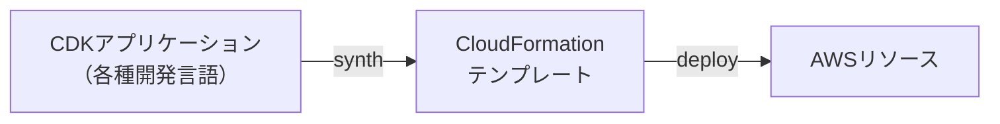
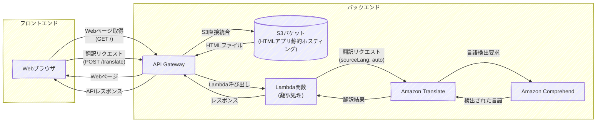

---
fonts:
  sans: Noto Sans JP
  serif: Noto Serif JP
  mono: Fira Code
theme: neversink
layout: cover
lineNumbers: true
---

# AWS CDK初心者ワークショップ

::note::

AWS CDKでインフラ構築を体験しよう！
90分で「できる！」を実感
TypeScriptで学ぶIaC

---
layout: top-title-two-cols
color: amber
align: l-lt-lt
---

::title::

# 自己紹介

::left::

自己紹介

::right::

画像

---
layout: top-title
color: amber
---

::title::

# 本日のゴール

::content::

- CDKの基本を理解する
- サンプルコードでCDKを体験
- 自分でWebアプリのインフラを構築

---
layout: top-title
color: amber
---

::title::

# 事前準備の確認

::content::

- ✅ AWSアカウント（Admin権限）
- ✅ ノートPC持参

---
layout: top-title-two-cols
color: amber
---

::title::

# 本日の流れ

::left::

<!-- Visual Studio Code Serverの構築に時間がかかるので最初にやってもらいます -->

<br/>
<br/>

1. Visual Studio Code Server環境の構築
2. CDKの概要
3. サンプルコードでCDKを動かす
4. コードの中身を理解
5. 自分でWebアプリのインフラを構築
6. まとめ・質疑応答

::right::

**本スライドのURL**:

https://bit.ly/cdk-workshop-2025
<br/>
<br/>
<div class="flex flex-col items-center">
  <QRCode
      :width="720"
      :height="720"
      value="http://bit.ly/4nz3B7d"
      image="./images/CDK_logo.png"
  />
</div>

<!-- 
本日ワークショップの作業を行うVSCode Serverを構築してもらいます。<br/>
このデプロイに時間がかかるので、これを待っている間にCDKについての簡単な説明をさせていただこうと思います。
 -->
---
layout: top-title
color: amber
---

::title::

# Visual Studio Code Serverを構築しよう

::content::

準備いただいたAWSアカウントにVisual Studio Code Serverを構築します。

**構築手順：**

1. 「TypeScript の基礎から始める AWS CDK 開発入門」にアクセス
    - https://catalog.workshops.aws/typescript-and-cdk-for-beginner/ja-JP

2. 左メニューから「開発環境のセットアップ」→「ご自身で実施するワークショップ」→「Visual Studio Code Server のセットアップ」にアクセス

2. ”Asia Pacific (Tokyo) ap-northeast-1"の「Launch Stack」ボタンをクリック

3. 以降、ページに記載された手順に従って、Visual Studio Code IDEを表示するところまで進めてください。

※ デプロイには約8分程度かかります。


---
layout: top-title
color: amber
---

::title::

# AWS CDKとは？

::content::

- AWS公式サポートの代表的なOSS IaCツール
- AWSのインフラをTypeScriptなどの開発言語で記述できる
  - TypeScript / JavaScript / Python / Java / C# / Golangに対応
- 開発言語で記述したコードからCloudFormationテンプレートを生成し、デプロイ
  - CloudFormationテンプレートの記法を覚えることなく、慣れた言語でインフラを定義



---
layout: top-title-two-cols
color: amber
align: l-lt-lt
---

::title::

# CDKの多言語対応例

::left::

## TypeScript

```ts
export class S3Stack extends cdk.Stack {
  constructor(scope: Construct, id: string,
   props?: cdk.StackProps) {
    super(scope, id, props);

    const bucket = new s3.Bucket(this, 'MyBucket', {
      bucketName: 'my-example-bucket-12345',
      versioned: true,
      publicReadAccess: false,
      removalPolicy: cdk.RemovalPolicy.DESTROY,
      autoDeleteObjects: true,
    });

    new cdk.CfnOutput(this, 'BucketName', {
      value: bucket.bucketName
    });
  }
}
```

::right::

## Python

```python
class S3Stack(Stack):
    def __init__(self, scope: Construct, 
      construct_id: str, **kwargs) -> None:
        super().__init__(scope, construct_id, **kwargs)

        bucket = s3.Bucket(self, "MyBucket",
            bucket_name="my-example-bucket-12345",
            versioned=True,
            public_read_access=False,
            removal_policy=RemovalPolicy.DESTROY,
            auto_delete_objects=True
        )

        CfnOutput(self, "BucketName",
            value=bucket.bucket_name
        )
```

---
layout: top-title
color: amber
---

::title::

# 体験：サンプルコードでCDKを動かしてみよう

::content::

まずは、事前に用意した翻訳Webアプリのサンプルコードを使って、CDKを体験してみましょう！

**手順：**
1. サンプルリポジトリをクローン
2. 依存関係をインストール
3. CDKコマンドでデプロイ
4. AWS上にリソースが作られる様子を確認
5. 実際にWebアプリを動かしてみる

**所要時間：** 約10-15分

---
layout: top-title
color: amber
---

::title::

# サンプルコードのアーキテクチャ

::content::

<br/>
<br/>



<div class="flex justify-center">
  <figure>
    
    <figcaption style="font-size: 10pt; text-align: center;">フロントエンド</figcaption>
  </figure>
</div>

---
layout: top-title
color: amber
---

::title::

# 実行手順 １（初回のみ）

::content::

1. リポジトリクローン

```bash 
git clone https://github.com/niizawat/cdk-workshop-example.git
cd cdk-workshop-example
```

<br/>

2. 依存関係インストール

```bash
npm install
```
<br/>

3. CDK Bootstrap

  CDKアプリケーションをデプロイする際に必要なリソースを作成
```bash
npx cdk bootstrap
# CDKアプリケーションをデプロイする際に必要なリソースを作成
```

---
layout: top-title
color: amber
---

::title::

# 実行手順 ２

::content::

4. CDK動作確認 (CDKコードをCloudFormationテンプレートに変換）

```bash
cdk synth
# 生成されたCloudFormationテンプレートが表示されればOK
```

<br/>

5. デプロイ内容の差分の確認（Optional）

```bash
cdk diff
# 生成されたCloudFormationテンプレートと現在のスタックの差分を表示
```

<br/>

5. AWSへデプロイ

```bash
cdk deploy
........
Do you wish to deploy these changes (y/n)?  <-- yを入力
```

---
layout: top-title
color: amber
---

::title::

# デプロイ後 の出力例

::content::

```bash {lines:false}
AppStack: deploying... [1/1]
AppStack: creating CloudFormation changeset...

 ✅  AppStack

✨  Deployment time: 94.21s

Outputs:
AppStack.ApiGatewayURL = https://xxxxxxxxxx.execute-api.ap-northeast-1.amazonaws.com/prod/
AppStack.BucketName = translate-website-123456789012-ap-northeast-1
AppStack.TranslateApiEndpointBF4D5864 = https://xxxxxxxxxx.execute-api.ap-northeast-1.amazonaws.com/prod/
AppStack.WebsiteURL = https://xxxxxxxxxx.execute-api.ap-northeast-1.amazonaws.com/prod/
Stack ARN:
arn:aws:cloudformation:ap-northeast-1:123456789012:stack/AppStack/d9b61de0-5485-11f0-a14f-06c66a81218f

✨  Total time: 97.31s
```

---
layout: top-title-two-cols
color: amber
align: l-lt-lt
---

::title::
# デプロイ後の動作確認

::left::

1. **Webアプリにアクセス**
   - ブラウザで `Website URL`にアクセス
   - アプリの画面が表示されることを確認

2. **翻訳APIのテスト**
   - ブラウザ上で翻訳機能を試す

::right::


<!-- 
Website URLは、前のスライドの出力例に表示されているURL
 -->

---
layout: top-title
color: amber
---

::title::

# CDKアプリケーションの基本的なディレクトリ構造

::content::

```sh {lines:false}
├── bin/
│   └── cdk.ts          # CDKアプリのエントリーポイント
├── lib/
│   └── app-stack.ts    # スタック定義（メインのインフラコード）
├── test/               # テストファイル格納ディレクトリ
├── cdk.json           # CDKプロジェクトの設定ファイル
├── jest.config.js      # テスト設定ファイル
└── tsconfig.json      # TypeScript設定ファイル
```

---
layout: top-title
color: amber
---

::title::

# CDKアプリのエントリーポイント

::content::

`bin/cdk.ts` はCDKアプリケーションのメインエントリーポイントです

```ts
#!/usr/bin/env node
import * as cdk from 'aws-cdk-lib';
import { AppStack } from '../lib/app-stack';

const app = new cdk.App();
new AppStack(app, 'AppStack', {
  /* 環境設定のオプション */
  // env: { account: process.env.CDK_DEFAULT_ACCOUNT, region: process.env.CDK_DEFAULT_REGION },
  // env: { account: '123456789012', region: 'us-east-1' },
});
```

**各行の解説：**
- `import * as cdk` - AWS CDKのコアライブラリを読み込み
- `import { AppStack }` - 自作のスタック定義を読み込み
- `new cdk.App()` - CDKアプリケーションのインスタンスを作成
- `new AppStack()` - スタックをアプリに追加

---
layout: top-title
color: amber
---

::title::

# CDKスタックの定義

::content::

`lib/app-stack.ts`

```ts {monaco} { height:'400px', editorOptions: { lineNumbers: 'on', minimap: 'enable' } }
import * as cdk from 'aws-cdk-lib';
import {
  aws_s3 as s3,
  aws_lambda as lambda,
  aws_apigateway as apigateway,
  aws_iam as iam,
  aws_s3_deployment as s3deploy,
} from 'aws-cdk-lib';
import { Construct } from 'constructs';

export class AppStack extends cdk.Stack {
  constructor(scope: Construct, id: string, props?: cdk.StackProps) {
    super(scope, id, props);

    // S3バケット（静的ファイル保存用）
    const websiteBucket = new s3.Bucket(this, 'TranslateWebsiteBucket', {
      bucketName: `translate-website-${this.account}-${this.region}`,
      publicReadAccess: false, // API Gateway経由でアクセスするためpublicアクセスは無効
      blockPublicAccess: s3.BlockPublicAccess.BLOCK_ALL,
      removalPolicy: cdk.RemovalPolicy.DESTROY, // バケット削除時にオブジェクトも削除
      autoDeleteObjects: true, // バケット削除時にオブジェクトも削除
    });

    // フロントエンドファイルのデプロイ
    new s3deploy.BucketDeployment(this, 'DeployWebsite', {
      sources: [s3deploy.Source.asset('./frontend')],
      destinationBucket: websiteBucket,
    });
    
    
    // Lambda関数（翻訳処理用）
    const translateFunction = new lambda.Function(this, 'TranslateFunction', {
      runtime: lambda.Runtime.NODEJS_22_X,
      handler: 'index.handler',
      code: lambda.Code.fromAsset('lambda/translate'),
      timeout: cdk.Duration.seconds(30),
    });

    // Lambda関数にTranslateとComprehendの権限を付与
    translateFunction.addToRolePolicy(new iam.PolicyStatement({
      effect: iam.Effect.ALLOW,
      actions: [
        'translate:TranslateText',
        'comprehend:DetectDominantLanguage'
      ],
      resources: ['*']
    }));


    // API Gateway（REST API）
    const api = new apigateway.RestApi(this, 'TranslateApi', {
      restApiName: 'Translate Service',
      description: 'AWS Translateを使用した翻訳API',
      // バイナリメディアタイプを設定（画像、CSS、JSファイルなど）
      binaryMediaTypes: [
        'image/*',
        'text/css',
        'application/javascript',
        'application/json',
        'text/html',
        'text/plain',
        'font/*'
      ]
    });

    // 翻訳用Lambda統合
    const translateIntegration = new apigateway.LambdaIntegration(translateFunction);

    // /translateエンドポイントの作成
    const translateResource = api.root.addResource('translate');
    translateResource.addMethod('POST', translateIntegration);

    // API GatewayがS3にアクセスするためのIAMロール
    const apiGatewayS3AccessRole = new iam.Role(this, 'ApiGatewayS3AccessRole', {
      assumedBy: new iam.ServicePrincipal('apigateway.amazonaws.com'),
    });

    // S3バケットの読み取りをAPI Gatewayに許可
    websiteBucket.grantRead(apiGatewayS3AccessRole);

    // ルートパス（/）用のS3統合 - S3バケットのindex.htmlを返す
    const rootIntegration = new apigateway.AwsIntegration({
      service: 's3',
      integrationHttpMethod: 'GET',
      path: `${websiteBucket.bucketName}/index.html`,
      options: {
        credentialsRole: apiGatewayS3AccessRole,
        passthroughBehavior: apigateway.PassthroughBehavior.WHEN_NO_TEMPLATES,
        integrationResponses: [
          {
            statusCode: '200',
            responseParameters: {
              'method.response.header.Content-Type': 'integration.response.header.Content-Type',
              'method.response.header.Content-Length': 'integration.response.header.Content-Length',
              'method.response.header.Timestamp': 'integration.response.header.Date'
            }
          },
          {
            statusCode: '400',
            selectionPattern: '4\\d{2}'
          },
          {
            statusCode: '500',
            selectionPattern: '5\\d{2}'
          }
        ]
      }
    });

    api.root.addMethod('GET', rootIntegration, {
      methodResponses: [
        {
          statusCode: '200',
          responseParameters: {
            'method.response.header.Content-Type': true,
            'method.response.header.Content-Length': true,
            'method.response.header.Timestamp': true
          }
        },
        {
          statusCode: '400'
        },
        {
          statusCode: '500'
        }
      ]
    });

    // 静的ファイル配信用のプロキシリソース（S3直接統合）
    const proxyIntegration = new apigateway.AwsIntegration({
      service: 's3',
      integrationHttpMethod: 'GET',
      path: `${websiteBucket.bucketName}/{proxy}`,
      options: {
        credentialsRole: apiGatewayS3AccessRole,
        passthroughBehavior: apigateway.PassthroughBehavior.WHEN_NO_TEMPLATES,
        requestParameters: {
          'integration.request.path.proxy': 'method.request.path.proxy'
        },
        integrationResponses: [
          {
            statusCode: '200',
            responseParameters: {
              'method.response.header.Content-Type': 'integration.response.header.Content-Type',
              'method.response.header.Content-Length': 'integration.response.header.Content-Length',
              'method.response.header.Timestamp': 'integration.response.header.Date'
            }
          },
          {
            statusCode: '400',
            selectionPattern: '4\\d{2}'
          },
          {
            statusCode: '500',
            selectionPattern: '5\\d{2}'
          }
        ]
      }
    });

    const proxyResource = api.root.addResource('{proxy+}');
    proxyResource.addMethod('GET', proxyIntegration, {
      requestParameters: {
        'method.request.path.proxy': true
      },
      methodResponses: [
        {
          statusCode: '200',
          responseParameters: {
            'method.response.header.Content-Type': true,
            'method.response.header.Content-Length': true,
            'method.response.header.Timestamp': true
          }
        },
        {
          statusCode: '400'
        },
        {
          statusCode: '500'
        }
      ]
    });

    // 出力値の設定
    new cdk.CfnOutput(this, 'WebsiteURL', {
      value: api.url,
      description: 'Website URL (via API Gateway)'
    });

    new cdk.CfnOutput(this, 'ApiGatewayURL', {
      value: api.url,
      description: 'API Gateway URL'
    });

    new cdk.CfnOutput(this, 'BucketName', {
      value: websiteBucket.bucketName,
      description: 'S3 Bucket Name'
    });

  }
}
```

---
layout: top-title
color: amber
---

::title::

# ハンズオン：シンプルなAPIを作ってみよう

::content::

まずは基本から！Hello WorldのAPIを作成しましょう

**使用するAWSサービス：**

- API Gateway（APIエンドポイント）
- Lambda（Hello World処理）

**作成するAPI：**
- `GET /hello` → `Hello, World!`を返す

---
layout: top-title
color: amber
---

::title::

# CDKプロジェクトの作成

::content::

```bash
# 新しいディレクトリを作成
mkdir my-hello-api
cd my-hello-api

# CDKプロジェクトを初期化
cdk init app --language typescript

# 必要なパッケージをインストール
npm install
```

---
layout: top-title
color: amber
---

::title::

# Lambda関数を作成しよう

::content::

Lambda = サーバーレスでコードを実行

まず、Lambda関数のコードファイルを作成します：

```bash
# Lambdaコード用のディレクトリを作成
mkdir -p lambda/hello

# Lambda関数のファイルを作成
touch lambda/hello/index.js
```

`lambda/hello/index.js` をエディタで開き、以下のコードを入力してください：

```js {monaco} { editorOptions: { lineNumbers: 'on' } }
exports.handler = async (event) => {
  return {
    statusCode: 200,
    headers: {
      'Content-Type': 'application/json',
    },
    body: JSON.stringify({
      message: 'Hello, World!',
      timestamp: new Date().toISOString()
    })
  };
};
```

次に、`lib/my-hello-api-stack.ts`を以下のように変更してLambda関数を定義します：

```ts {monaco} { editorOptions: { lineNumbers: 'on' } }
import * as cdk from 'aws-cdk-lib';
import * as lambda from 'aws-cdk-lib/aws-lambda';
import { Construct } from 'constructs';

export class HelloApiStack extends cdk.Stack {
  constructor(scope: Construct, id: string, props?: cdk.StackProps) {
    super(scope, id, props);

    // Lambda関数（Hello World処理用）
    const helloFunction = new lambda.Function(this, 'HelloFunction', {
      runtime: lambda.Runtime.NODEJS_22_X,
      handler: 'index.handler',
      code: lambda.Code.fromAsset('lambda/hello'),
    });
  }
}
```

---
layout: top-title
color: amber
---

::title::

# API Gatewayを作成しよう

::content::

```ts {3|16-33}{ maxHeight:'400px'}
import * as cdk from 'aws-cdk-lib';
import * as lambda from 'aws-cdk-lib/aws-lambda';
import * as apigateway from 'aws-cdk-lib/aws-apigateway';
import { Construct } from 'constructs';

export class HelloApiStack extends cdk.Stack {
  constructor(scope: Construct, id: string, props?: cdk.StackProps) {
    super(scope, id, props);

    // Lambda関数（Hello World処理用）
    const helloFunction = new lambda.Function(this, 'HelloFunction', {
      runtime: lambda.Runtime.NODEJS_22_X,
      handler: 'index.handler',
      code: lambda.Code.fromAsset('lambda/hello'),
    });
    // API Gateway（REST API）
    const api = new apigateway.RestApi(this, 'HelloApi', {
      restApiName: 'Hello World API',
      description: 'シンプルなHello World API',
    });

    // Lambda統合
    const helloIntegration = new apigateway.LambdaIntegration(helloFunction);

    // /helloエンドポイントの作成
    const helloResource = api.root.addResource('hello');
    helloResource.addMethod('GET', helloIntegration);

    // 出力値の設定
    new cdk.CfnOutput(this, 'ApiUrl', {
      value: api.url,
      description: 'API Gateway URL'
    });
  }
}
```

---
layout: top-title
color: amber
---

::title::

# 動作確認してみよう

::content::

```bash {lines:false}
# デプロイ
cdk deploy

# API Gateway URLにアクセス
curl https://xxxxxxxxxx.execute-api.ap-northeast-1.amazonaws.com/prod/hello

# レスポンス例
{
  "message": "Hello, World!",
  "timestamp": "2024-01-15T10:30:00.000Z"
}
```

---
layout: top-title
color: amber
---

::title::

# 🎉 おめでとうございます！

::content::

CDKを使ってシンプルなAPIを作成できました！

**できたこと：**
- Lambda関数の作成
- API Gatewayの作成
- CDKでのデプロイ

---
layout: top-title
color: amber
---

::title::

# 🚀 発展課題にチャレンジ！

::content::

以下の課題にチャレンジしてみましょう：

**レベル3：外部サービス連携**
- Amazon Translateを使った翻訳API
- DynamoDBを使ったデータ保存API
- S3を使ったファイルアップロードAPI

API Documentのリンク

---
layout: top-title
color: amber
---

::title::

# 発展課題：Amazon Translate API

::content::

```ts {monaco} { editorOptions: { lineNumbers: 'on' } }
// Lambda関数にTranslateとComprehendの権限を付与
translateFunction.addToRolePolicy(new iam.PolicyStatement({
  effect: iam.Effect.ALLOW,
  actions: [
    'translate:TranslateText',
    'comprehend:DetectDominantLanguage'
  ],
  resources: ['*']
}));

// /translateエンドポイントの作成
const translateResource = api.root.addResource('translate');
translateResource.addMethod('POST', new apigateway.LambdaIntegration(translateFunction));
```

**Lambda関数の例：**
```js
const { TranslateClient, TranslateTextCommand } = require('@aws-sdk/client-translate');

exports.handler = async (event) => {
  const { text, targetLang = 'ja' } = JSON.parse(event.body);
  
  const translateClient = new TranslateClient({ region: process.env.AWS_REGION });
  const result = await translateClient.send(new TranslateTextCommand({
    Text: text,
    SourceLanguageCode: 'auto',
    TargetLanguageCode: targetLang
  }));
  
  return {
    statusCode: 200,
    body: JSON.stringify({ translatedText: result.TranslatedText })
  };
};
```

---
layout: top-title
color: amber
---

::title::

# 片付け（重要！）

::content::

作成したリソースを削除して、課金を防ぎましょう

```bash {lines:false}
# リソースを削除
cdk destroy
```

<br/>

VSCode Serverを削除（ご自分のアカウントを利用された方）

- AWSマネジメントコンソールでCloudFormationコンソールにアクセス
- `vscode-server`スタックを選択して、削除ボタンをクリック

---
layout: top-title
color: amber
---

::title::

# まとめ

::content::

**今日学んだこと：**

- CDKでインフラをコードで管理する方法
- TypeScriptでAWSリソースを定義する書き方
- デプロイから削除までの一連の流れ

**CDKの魅力：**

- 可読性が高い
- 再利用可能
- バージョン管理できる
- チームで共有しやすい

---
layout: top-title
color: amber
---

::title::

# さらに学ぶために

::content::

- **AWS CDK公式ドキュメント**: <https://docs.aws.amazon.com/cdk/>
- **AWS CDK Workshop**: <https://cdkworkshop.com/>
- **CDK Examples**: <https://github.com/aws-samples/aws-cdk-examples>
- **AWS Solutions Constructs**: <https://docs.aws.amazon.com/solutions/latest/constructs/welcome.html>
- **Construct Hub**: <https://constructs.dev/>
- **Amazon Q Developer CLI ではじめる、効率的なアプリケーション開発**: <https://aws.amazon.com/jp/builders-flash/202505/q-developer-cli-app-development/>

---
layout: top-title
color: amber
---

::title::

# 質疑応答

::content::

ご質問をお聞かせください！

- CDKに関する疑問
- 今日のハンズオンについて
- 実際の現場での活用方法
- etc.

---
layout: top-title
color: amber
addons:
  - - "@katzumi/slidev-addon-qrcode"
---

::title::

# ありがとうございました

::content::

お疲れさまでした！
皆さんの今後のAWS CDK活用を応援しています 🎉

**アンケートのご協力をお願いします**

<br/>
<br/>

<div class="flex flex-col items-center">
  <QRCode
      :width="720"
      :height="720"
      value="https://sli.dev"
      image="./images/CDK_logo.png"
  />
</div>