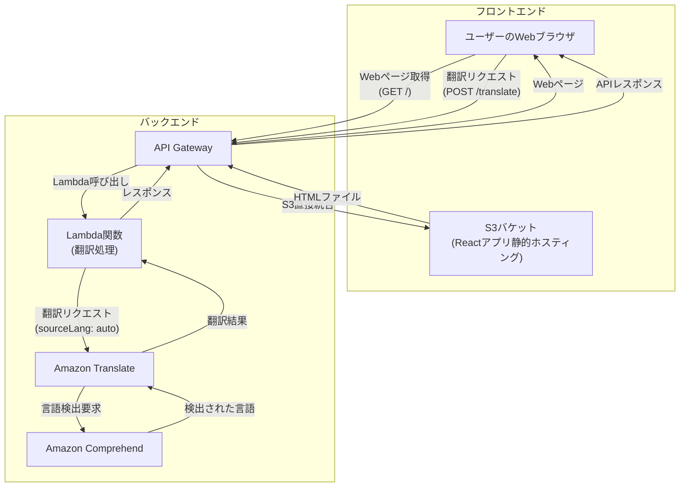

# AWS CDKワークショップ スライドプロット（最新版）

---

## 1. オープニング

- ワークショップの目的
- 本日のゴール
- 講師自己紹介
- 参加者へのメッセージ

---

## 2. 事前準備の確認

- AWSアカウント・Admin権限の確認
- AWS CLIがインストールされ、設定が完了していること
- 本日の流れ

---

## 3. インフラとIaCの再確認

- インフラとは？（簡単に）
- IaC（Infrastructure as Code）とは？
- IaCのメリット・現場での活用例

💡ヒント  
「手作業と自動化の違い」を強調

---

## 4. AWS CDKとは？

- CDKの概要
- CDKの特徴・メリット
- どんな時に使う？

---

## 5. 体験：サンプルコードでCDKを動かしてみよう

- 事前に用意したリポジトリの紹介
- サンプルコードのクローン方法
- CDKコマンドでインフラを構築
- 実際にAWS上にリソースができる様子を確認

💡ヒント  
「うまくいかない場合は講師やサポーターに声をかけてください」

---

## 6. サンプルコードの中身を見てみよう

- CDKプロジェクトの構成
- スタック・リソースの概念
- デプロイの流れ
- どんなコードでインフラが作られているか
- 主要なファイル・記述のポイント
- 変更・追加が簡単なことを体感

---

## 7. ハンズオン全体像

- これから自分で作るWebアプリのインフラ構成図
- 使うAWSサービス（S3, Lambda, API Gatewayなど）の紹介

---

## 8. CDKプロジェクトの作成

- プロジェクト新規作成手順
- ディレクトリ構成の確認

---

## 9. S3バケットの作成

- S3とは？（一言で）
- CDKでS3バケットを追加する方法
- コード例（TypeScript＋monaco記法）

💡ヒント  
エラーが出た時の対処法

---

## 10. Lambda関数の作成

- Lambdaとは？（一言で）
- CDKでLambda関数を追加する方法
- コード例（TypeScript＋monaco記法）

---

## 11. API Gatewayの作成

- API Gatewayとは？（一言で）
- CDKでAPI Gatewayを追加する方法
- コード例（TypeScript＋monaco記法）

---

## 12. リソースの連携

- S3・Lambda・API Gatewayのつなげ方
- 依存関係の考え方

---

## 13. デプロイと動作確認

- デプロイ手順
- 動作確認の方法

💡ヒント  
「デプロイに時間がかかる場合は焦らず待ちましょう」

---

## 14. よくあるエラーと対処法

- 失敗しやすいポイント
- エラー例と解決策

---

## 15. 片付け（リソース削除）

- リソースの削除方法
- 削除時の注意点

---

## 16. まとめ・振り返り

- 今日学んだこと
- CDKの活用例
- さらに学ぶためのリソース

---

## 17. 質疑応答・クロージング

- 質問タイム
- アンケート案内
- お礼と今後の案内

---

<!--
※今後のスライド作成時は、図解（mermaid記法）やTypeScript＋monaco記法のコード例を積極的に活用し、初心者にも分かりやすい資料を目指します。
--> 