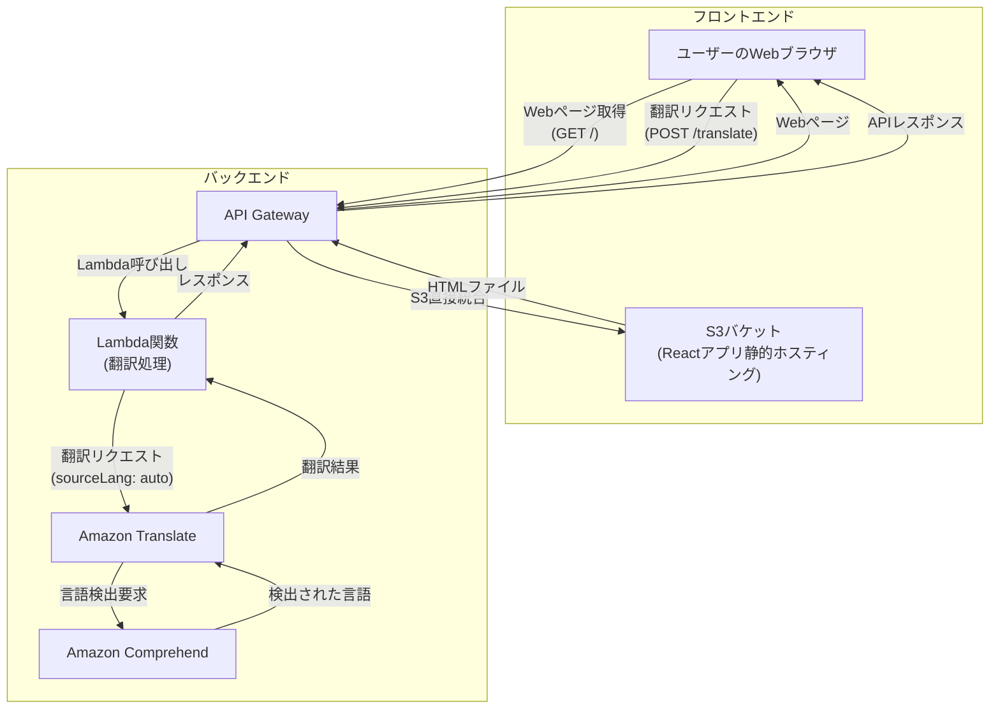

# 指示書

## あなたの役割

あなたは、AWS CDKの教育に情熱を注ぐ経験豊富なトレーナーです。

## 作成する資料

AWSユーザー向けカンファレンスで行うAWS CDKを初めて学ぶエンジニア向けの90分間のオフラインワークショップ用スライド資料。

## ターゲットオーディエンス

*   **知識レベル**
    *   プログラミング（TypeScript）の基礎知識は多少ある
    *   AWSユーザーのカンファレンスで行うためAWSの基礎知識は有してしている
    *   IaCの概念はある程度知っているが、CDKは初心者。
*   **参加条件**
    *   ノートPCを持参し、TypeScriptの開発環境が整っていること。
    *   AWSアカウントを持っていること。Admin権限が必要。
    *   AWS CLIがインストールされており、設定が完了していること。
*   **ゴール:**
    *   ワークショップ後、簡単なWebアプリのインフラをCDKで構築できるようになる。

## 資料のトーン＆マナー

*   専門用語は避け、平易な言葉で解説してください。
*   難しい概念は、身近なものに例えて説明してください。
*   図で説明できるところは図を使ってください。図はmarkdownのコードで表現してください。
*   参加者を励ますような、親しみやすい口調でお願いします。
*   初心者がつまずきやすいポイントは「💡ヒント」として補足してください。

## 出力形式

*   Markdown形式で出力してください。
    *   Slidevでスライド表示することを想定しています。Slidevの表記法については以下URLを参照してください。
        *  @https://sli.dev/guide/syntax
    *  作成するスライド資料は、`contents/slide/slide-workshop.md`というファイル名で保存してください。
*   内容は箇条書きで簡潔にまとめてください。
*   話者が話すべき補足情報は SlidevのNodes記法で記述してください。
*   スライドのタイトルは、内容を端的に表現してください。
*   スライドの内容は、参加者が後で見返せるように、必要な情報を含めてください。
*   スライドの数は、90分間のワークショップに適した枚数（約20枚程度）にしてください。
*   各スライドの内容は、参加者が理解しやすいように、段階的に学べるように構成してください。
*   各スライドの内容は、参加者が実際に手を動かす時間も考慮して、適度な量にしてください。
*   CDKのコード例は、TypeScriptで記述し、[monaco](https://sli.dev/custom/config-monaco)記法を利用してください。

## ハンズオンの内容の案

ユーザーがAWS CDKを実際に使ってコーディングを行う前に、事前にリポジトリに準備しておいたサンプルコードを使って、CDKを使うといかに簡単にインフラを構築できるかを体験してもらいます。
その後、ユーザーが自分でCDKを使って簡単なWebアプリのインフラを構築するハンズオンを行います。

### サンプルコードの内容

### ハンズオンで使用する環境

Visual Studio Code ServerをEC2インスタンスを、参加者のAWSアカウントに構築してもらいます。
構築には、AWS提供のCloudFormationテンプレートを利用します。
CloudFormationテンプレートは、ワークショップ「TypeScript の基礎から始める AWS CDK 開発入門」の「ご自身で実施するワークショップ」→「Visual Studio Code Server のセットアップ」に記載されています。
URLは以下です。

* [Visual Studio Code Server のセットアップ](https://catalog.workshops.aws/typescript-and-cdk-for-beginner/ja-JP/10-getting-started/20-self-hosted/10-vscode-server)

構築は、「# 体験：サンプルコードでCDKを動かしてみよう」の一番最初に各参加者に実施して貰う必要があります。
